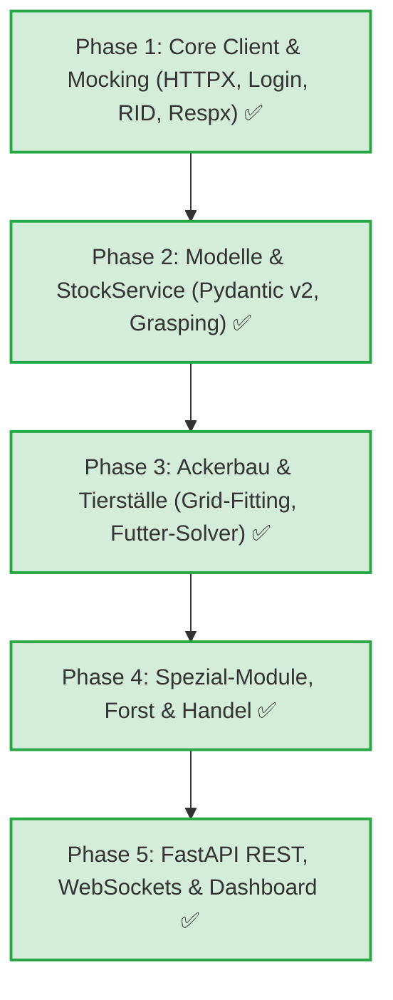

# Python Redesign Spezifikation & Gesamtarchitektur

Dieses Dokument beschreibt die Zielarchitektur, Projektstruktur und den Migrationsleitfaden für das Redesign der MyFreeFarm-Anwendung in modernem Python 3.11+.

Die Architektur ist konsequent auf einen **robusten Single-Account-Betrieb**, **10-Minuten-Polling-Zyklen** und **dateibasierte Konfiguration ohne Datenbank-Overhead** optimiert.

---

## 1. Kernprinzipien & Technologie-Stack

### 1.1 Entwurfsprinzipien
1. **Single-Account & Zustandslosigkeit:** Der Bot verwaltet genau einen Account auf einem Zielserver. Da der Spielserver bei jedem Request den vollständigen Zustand (`updateblock`, `datablock`) liefert, benötigt der Bot keine persistente relationale Datenbank.
2. **Dateibasierte Konfiguration:** Alle Einstellungen (Zugangsdaten, Mindestbestände, Anbaustrategien) werden über eine transparente `config.yaml` (bzw. `.env`) via **Pydantic Settings** gepflegt.
3. **10-Minuten-Zyklus:** Der Worker folgt einer festen 10-Minuten-Schleife (`asyncio.sleep(600)`), ergänzt um randomisierten Jitter zur Erkennungsvermeidung.
4. **Toolchain mit `uv`:** Schnelle und deterministische Paketverwaltung über Astral `uv`.
5. **Realtime-Fähigkeit:** REST-API nach Vorbild der Express-Routen plus WebSockets für Live-Log- und Status-Streaming.

### 1.2 Technologie-Stack-Vergleich

| Komponente | JavaScript (Ist-Zustand) | Python (Soll-Zustand) | Begründung |
| :--- | :--- | :--- | :--- |
| **Laufzeitumgebung** | Node.js | **Python 3.11+** | Native Typehints, Asyncio Task-Handling |
| **Paketmanager** | npm | **`uv` (Astral)** | Extrem schnelle Installation, deterministisches Locking |
| **REST-Framework** | Express.js 4 | **FastAPI** | Automatische OpenAPI-Doku (`/docs`), Pydantic v2 |
| **Datenvalidierung** | Ad-hoc / ungetypt | **Pydantic v2** | Typsichere Upstream-DTOs und Domain-Models |
| **HTTP-Client** | Unirest / Kew | **HTTPX (AsyncClient)** | Native Async/Await, Cookie-Jar, Anti-Detection Jitter |
| **Konfiguration** | `conf` / `configstore` / JSON | **Pydantic Settings + YAML** | Typsicher, validiert, keine DB-Abhängigkeit |
| **Datenbank** | PouchDB (kaum genutzt) | **Keine (In-Memory State)** | Live-Zustand kommt direkt vom Spielserver |
| **Logging** | Winston / Custom Logger | **Loguru** | Strukturierte Logs, Farb-Konsole, Datei-Rotation |
| **Testing & Mocking** | Keine | **pytest + respx** | Offline-Simulation aller Upstream-Server-Endpunkte |

---

## 2. Schichtenarchitektur (Clean Layering)

Die Anwendung ist in 5 klar voneinander entkoppelte Schichten unterteilt:

```
┌─────────────────────────────────────────────────────────────┐
│                   1. Presentation Layer                     │
│    FastAPI REST Endpoints (/api/v1/*)  &  WebSocket /ws/live│
└──────────────────────────────┬──────────────────────────────┘
                               │
┌──────────────────────────────▼──────────────────────────────┐
│                    2. Orchestration Layer                   │
│         Single-Account 10-Minuten Worker Loop (asyncio)     │
└──────────────────────────────┬──────────────────────────────┘
                               │
┌──────────────────────────────▼──────────────────────────────┐
│               3. Domain Services & Game Modules             │
│   StockService, MarketService, TradeService, QuestService   │
│   Agriculture, Forestry, FarmBuildings, Stall, Helpers      │
└──────────────────────────────┬──────────────────────────────┘
                               │
┌──────────────────────────────▼──────────────────────────────┐
│            4. State & Models Layer (Pydantic v2)            │
│       In-Memory GameState (Stock, Farms, Buildings, Credit) │
└──────────────────────────────┬──────────────────────────────┘
                               │
┌──────────────────────────────▼──────────────────────────────┐
│                  5. Upstream Client Layer                   │
│   MFFGameClient (HTTPX, Session-RID, Jitter, Error Recovery) │
└─────────────────────────────────────────────────────────────┘
```

---

## 3. Projektstruktur

Das Python-Projekt liegt isoliert im Unterordner [`myfreefarm_python/`](../myfreefarm_python/):

```
myfreefarm_python/
├── pyproject.toml              # Build-Konfiguration & Abhängigkeiten (uv / pip)
├── README.md                   # Kurzanleitung für uv, Tests und Ausführung
├── config.yaml.example         # Beispielkonfiguration für Strategien & Limits
├── .env.example                # Beispiel für Zugangsdaten & Secrets
│
├── app/
│   ├── __init__.py
│   ├── main.py                 # FastAPI App, Lifespan-Handler & Middleware
│   ├── config.py               # Pydantic Settings (YAML + .env Loader)
│   │
│   ├── core/                   # Technische Infrastruktur
│   │   ├── client.py           # MFFGameClient (Async HTTPX, Login, RID, Jitter)
│   │   ├── exceptions.py       # Domänenfehler (AuthError, SessionExpired)
│   │   └── logging.py          # Loguru Konfiguration & Log-Handler
│   │
│   ├── models/                 # Pydantic v2 Datenmodelle (siehe Doc 13)
│   │   ├── product.py          # Product Domain Model
│   │   ├── farm.py             # FarmField & PlantTile Models
│   │   ├── game_state.py       # In-Memory GameState Schema
│   │   └── upstream.py         # Upstream-DTOs (PHP Response Parser)
│   │
│   ├── services/               # Fachliche Kernservices
│   │   ├── stock_service.py    # Lagerhaltung & Rohstoff-Grasping
│   │   ├── market_service.py   # Marktplatz Kauf / Verkauf
│   │   ├── trade_service.py    # Automatischer Überschussverkauf
│   │   ├── contract_service.py # Vertragsannahme und -versand
│   │   └── quest_service.py    # Hauptquest-Abarbeitung
│   │
│   ├── modules/                # Fachliche Spielmodule
│   │   ├── agriculture/        # Ackerbau (Field, Farm, Grid-Fitting, SushiBar)
│   │   ├── forestry/           # Forstwirtschaft (Wald, Sägewerk, Schreinerei)
│   │   ├── farm_buildings/     # Hauptfarm-Gebäude (Shed, Futter-Optimierer)
│   │   ├── farmersmarket/      # Gärtnerei (Nursery), Tierzucht
│   │   ├── stall/              # Obststand / Marktbude
│   │   ├── insecthotel/        # Insektenhotel
│   │   ├── foodworld/          # Picknick & Restaurant
│   │   └── helpers/            # Braver Ben, Goldesel, Windmühle, Tagesboni
│   │
│   ├── api/                    # REST- & WebSocket-Schnittstellen
│   │   ├── router.py           # Zentraler Router (/api/v1)
│   │   ├── websocket.py        # Live-Log & State Broadcasts (/ws/live)
│   │   └── endpoints/          # farms, plants, stock, offers, contracts, forestry
│   │
│   └── worker/                 # Automations-Orchestrierung (siehe Doc 14)
│       └── scheduler.py        # 10-Minuten Hauptschleife & Sequenz-Ablauf
│
└── tests/
    ├── conftest.py             # Pytest Fixtures
    ├── test_models.py          # Validierung der Pydantic-Modelle
    ├── test_algorithms.py      # Tests für Grid-Fitting & Futteroptimierung
    └── mock_server/            # respx Mocks für Upstream MyFreeFarm Endpunkte
```

---

## 4. Konfigurationsmodell (`config.yaml`)

Statt einer Datenbank steuert eine transparente YAML-Datei das gesamte Verhalten des Bots:

```yaml
# config.yaml (Beispiel)
account:
  server: 1
  username: "MeinFarmer"
  password: "GeheimesPasswort"

scheduler:
  poll_interval_seconds: 600  # 10 Minuten
  anti_detection_min_delay_ms: 350
  anti_detection_max_delay_ms: 900

agriculture:
  farm: 1
  field_position: 1
  plant_strategy: "plantQuest"  # plantQuest, plantMin, plantOrders
  min_products: 500
  auto_crop: true
  auto_water: true

trade:
  enabled: true
  min_credit_kt: 500.0
  underbid_offset_kt: 0.01

modules_enabled:
  stock: true
  agriculture: true
  forestry: true
  shed: true
  helpers: true
  trade: true
  quest: true
```

---

## 5. Schnittstellen: REST-API & WebSockets

### 5.1 REST-API (`/api/v1/*`)
Vollständige Abwärtskompatibilität zum bestehenden Express-Frontend:
- `POST /api/v1/login`: Erzeugt JWT-Token für das Dashboard.
- `GET /api/v1/farms`: Liefert aktuellen Zustand aller Farmen und Äcker.
- `GET /api/v1/stock`: Liefert aktuellen Lagerbestand (`StockResponse`).
- `GET /api/v1/plants`: Liefert Katalog aller Pflanzen und Wachstumszeiten.
- `GET /api/v1/offers`: Aktive Marktplatz-Angebote.
- `GET /api/v1/contracts`: Vorliegende Spielerverträge.
- `POST /api/v1/bot/trigger`: Löst sofort einen Bot-Lauf außerhalb des 10-Minuten-Takts aus.

### 5.2 Realtime WebSocket (`/ws/live`)
Ermöglicht dem Dashboard den Empfang von:
- Live-Log-Einträgen in Echtzeit.
- Statusänderungen des Bots (`IDLE`, `RUNNING`, `SLEEPING`).
- Timer-Countdown bis zum nächsten 10-Minuten-Lauf.

---

## 6. Schritt-für-Schritt Migrationsplan



### Phase 1: Core Client, Session & Mock-Framework ✅ (Abgeschlossen)
- [x] `MFFGameClient` implementiert: 2-Schritt-Login (`createtoken2.php` $\rightarrow$ `var rid`), Anti-Detection Jitter (350–900 ms), Session-Recovery (automatischer Re-Login mit Exponential Backoff).
- [x] Maskiertes Debug-Logging für Passwörter und sensible Payloads (`mask_sensitive_data`).
- [x] Deterministische Offline-Testsuite mit `respx` (8 Szenarien) in `tests/test_client.py`.
- [x] End-to-End Live-Test (`tests/test_live.py`) und CLI-Smoke-Test (`python -m app.core.client`) erfolgreich gegen Server 21 verifiziert.

### Phase 2: Produktkatalog & StockService ✅ (Abgeschlossen)
- [x] Automatischer Katalog-Parser (`CatalogService`) für HTML-Arrays und externe `jsconstants_*.js`.
- [x] Marktplatz-Service (`MarketService`) für gezielten Einkauf der günstigsten Angebote (`marketbuyoffer`).
- [x] Saatguthändler-Service (`SeedDealerService`) als Festpreis-Fallback für Ackerbau-Saatgut (`shopfire`).
- [x] `StockService` mit reaktivem In-Memory-Lager (`stock.stock` & `tempstock`) und intelligenter Rohstoffbeschaffung (`grasp_products`) inkl. Vorratspuffer und Kontoguthabenschutz (`min_credit_kt`).
- [x] Offline-Testsuite mit `respx` (8 Tests in `tests/test_stock.py`) und Live-Inventarprüfung gegen Server 21 (`tests/test_live_stock.py`).

### Phase 3: Ackerbau & Tierställe (Kern-Automatisierung) ✅ (Abgeschlossen)
- [x] Portierung von `Field` & `PlantTile`: 120-Felder Tile-Status (`inhalt`, Phase 1-4, `zeit`, Bewässerung), Ernte-Logik (`crop()` mit konfigurierbarem Erntemodus `"all"` oder `"any"`), Bepflanzung (`autoplant`) und Bewässerung (`watergarden`).
- [x] Intelligente Pflanz-Strategien in `PlantStrategySolver`: `plantQuest` (Priorisierung von Quest-Fehlmengen) und `plantMin` (Wiederauffüllen der geringsten Bestände unterhalb des Minimal-Limits).
- [x] Portierung von `Shed`: Zyklus für Tierställe (`inner_init`, `inner_crop`, `inner_feed`) mit mathematischem Futterkosten-Minimierer $K_i = \lfloor\frac{T_{\text{rest}}}{t_i}\rfloor \cdot N_{\text{tiere}} \cdot P_i$ und automatischer Rohstoffbeschaffung via `StockService.grasp_products`. Graceful Handling für unbesetzte Ställe.
- [x] Gebäude-Erkennung und Multi-Farm Orchestrierung in `FarmService` (dynamische Erkennung aller Äcker und Ställe über `getfarms`).
- [x] Vollständige Offline-Testsuite mit `respx` (5 Tests in `tests/test_agriculture.py`) und Read-Only Live-Inspektion auf Server 21 (`tests/test_live_agriculture.py`), die 28 Äcker und 6 Ställe erfolgreich erfasst hat.

### Phase 4: Spezial-Module, Nebenwirtschaft & Handel ✅ (Abgeschlossen)
- [x] **Forstwirtschaft (`ForestryService`)**:
  - `Forrest`: 25 Wald-Slots, Fällung schlagreifer Bäume (`cropall`), automatische Wiederaufforstung (`autoplant`) mit Setzlingen der Stammholzart mit dem geringsten Lagerbestand, Gießen (`water`).
  - `Factory` (`Sawmill` & `Carpentry`): Fertigstellung abholen (`cropproduction`), automatische Produktion in freien Slots mit Rohstoffverfügbarkeitsprüfung (`startproduction`).
  - `ForestryFarmis`: Sofortige Bedienung wartender Kunden an der Waldhütte (`sellfarmi`), wenn geforderte Holzwaren im Lager vorliegen.
- [x] **Handel (`TradeService`)**:
  - Automatischer Verkauf von Lagerüberschüssen oberhalb der Mindestreserve (`amount - min_reserve >= batch_size`).
  - Automatische Preisfindung: Ermittelt das günstigste aktuelle Marktangebot und unterbietet es minimal (`P_markt - 0.01 kT`), jedoch nie unter den Basiskatalogpreis.
  - Schutz des Mindestguthabens (`min_credit_kt`) vor Einstellebühren.
- [x] **Quests (`QuestService`)**:
  - Auslesen aktiver Quests aus `updateblock.queststatus.main` inkl. Bedarfs- und Fehlmengenanalyse gegen das Lager.
  - Korrigierter Parser für PHP-Arrays (`data["1"][0]`) zur Vermeidung von Fehlinterpretationen von Zeitstempeln als Produkt-IDs; Filterung abgelaufener Quests.
  - Direkte Integration in `PlantStrategySolver` (`plantQuest`) zur Priorisierung von Quest-Bedarfen auf den Farm-Feldern.
- [x] **Tägliche Helfer & Boni (`HelpersService`)**:
  - Braver Ben (`dogbonus`): Einmal tägliche 10-Minuten-Verkürzung für alle Hofproduktionen.
  - Goldesel Waltraud (`dailydonkey`): Täglicher kT-Münzenbonus.
  - Losbude (`initlottery`, `newlot`, `lotgetprize`): Tägliches kostenloses Los in Dorf 2 abholen.
  - Windmühle (`windmillinit`, `windmillcrop`, `windmillstartproduction`): Fertigprodukte ernten und neue Backaufträge starten mit Rohstoffbeschaffung via `StockService.grasp_products`.
- [x] **Biosprit-Anlage (`Fuelstation`)**:
  - Gebäude-ID 20 auf Farm 4 Bauplatz 6.
  - Automatisches Ernten fertiger Marken (`fuelstation_harvest`) und Befüllen freier Slots (`fuelstation_entry`) mit Überschuss-Crops unter Schutz der Mindestreserve (`min_reserve`).
  - Schutz gesperrter Slots (`block: 1`) vor ungewolltem Coin-Verbrauch.
- [x] **Tests & Verifikation**:
  - 18 neue Offline-Tests (`respx` in `tests/test_forestry.py`, `tests/test_trade_quest.py`, `tests/test_helpers.py`, `tests/test_fuelstation.py`), alle 41 Offline-Tests bestehen fehlerfrei.
  - Read-Only Live-Inspektion gegen Server 21 (`tests/test_live_phase4.py`): 25/25 Bäume, 2 Sägewerk-Slots (PID 61 aktiv), 51 Holzlager-Positionen, 5 Waldhütten-Kunden, Quest #4 (Naturschutzquest Alm Melisse & Malve), Braver Ben, Goldesel, Windmühle und Biosprit-Anlage (Level 9, 146.521 Marken) verifiziert.

### Phase 5: REST-API, WebSockets & Live-Dashboard ✅ (Abgeschlossen)
- [x] **JWT Authentifizierung & Security (`app/core/auth.py`)**:
  - Konfigurierbare Dashboard-Credentials (`api_username`, `api_password` via `.env` / Settings).
  - JWT Access Token Generierung & Validierung (HS256) für HTTP Bearer Header und WebSocket Query-Parameter `?token=...`.
  - Abwärtskompatibler Login-Endpunkt `POST /api/v1/login` (liefert `access_token` und `accessToken`).
- [x] **Domain REST Endpoints (`app/api/endpoints/`)**:
  - `/api/v1/plants`: Pflanzendatenbank mit Filtern & Suchfunktion.
  - `/api/v1/farms`: Status aller Äcker, Erntebereitschaft, Bepflanzung & Konfigurations-Update (`PUT`).
  - `/api/v1/stock`: Lagerübersicht, kT-Guthaben, Warenbestände & Kaufaufträge (`/orders`).
  - `/api/v1/offers`: Marktplatz-Verkaufsregeln, Batchgrößen & automatisches Trading.
  - `/api/v1/contracts`: Spielerverträge mit Lagerbestandserfüllungsprüfung.
  - `/api/v1/forestry` & `/api/v1/foodworld`: Holzwirtschaft & Foodworld-Bestände / Aufträge.
  - `/api/v1/bot`: Status des Schedulers (`GET /status`) und Sofortstart (`POST /trigger`).
- [x] **Realtime WebSocket Streaming (`/ws/live`)**:
  - Loguru WebSocket-Sink: Streamt jeden Loglevel-Eintrag in Echtzeit an verbundene Dashboard-Clients.
  - Scheduler Heartbeat- und Countdown-Timer-Events (`type: "status"`, `type: "countdown"`).
  - Sichere Authentifizierung via `?token=...`.
- [x] **Single-Page Web Dashboard (`app/static/index.html`)**:
  - Integriertes, responsives Dashboard (Tailwind CSS, Vanilla JS, WebSocket).
  - Live-Status-Badge, Countdown bis zum nächsten Durchlauf, Sofortstart-Button ("⚡ Sofort starten").
  - Interaktive Tabs: Farmen & Acker-Wachstumsraster, Live-Streaming-Konsole mit Autoscroll, durchsuchbares Lager-Inventar, Konfigurationseditor.
  - Bereitstellung unter `/` und `/dashboard` im FastAPI Backend.
- [x] **Testsuite & Qualitätssicherung**:
  - 19 neue Unit- & Integrationstests (`tests/test_api_auth.py`, `tests/test_api_endpoints.py`, `tests/test_websocket.py`).
  - 60/60 Tests erfolgreich passing (`uv run pytest -m "not live"`). Ruff Linting 100% sauber.

### Ausblick: Erweiterungsmodule (Phasen 6 – 11) 📋
Für die verbleibenden, spezialisierten Module aus der Node.js-Codebasis (Bauernmarkt, Obststand, Insektenhotel, Foodworld, Sushibar, Verträge, Events, Konfig-Persistenz) existiert ein eigenständiger, modularer Phasenplan in:
👉 **[`16-python-extension-modules-plan.md`](16-python-extension-modules-plan.md)**

---

## 7. Verwandte Dokumente

- [**16-python-extension-modules-plan.md**](16-python-extension-modules-plan.md): Detaillierter Phasenplan (Phasen 6–11) für Spezial- & Nebenmodule.
- [**15-python-fastapi-api-and-dashboard.md**](15-python-fastapi-api-and-dashboard.md): FastAPI REST-API, WebSockets & Single-Page Dashboard.
- [**14-python-worker-and-scheduler.md**](14-python-worker-and-scheduler.md): Single-Account 10-Minuten Worker-Loop, Session-Lifecycle, Anti-Ban & Mock-Testing.
- [**13-python-models-and-algorithms.md**](13-python-models-and-algorithms.md): Pydantic v2 Schemas, Multi-Tile Fitting, Futter-Optimierungs-Solver & Trade-Algorithmen.
- [**11-external-game-api.md**](11-external-game-api.md): Upstream-Protokoll von `myfreefarm.de`.
- [**00-README.md**](00-README.md): Gesamtinhaltsverzeichnis des LLM-Wikis.
