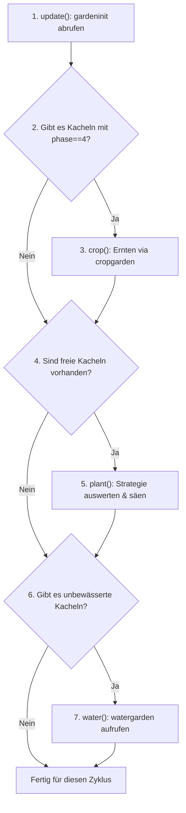

# Python Datenmodelle & Entscheidungs-Algorithmen

Dieses Dokument spezifiziert die **Pydantic v2 Datenstrukturen** und die **fachlichen Optimierungsalgorithmen** für das Python-Redesign der MyFreeFarm-Engine.

---

## 1. Pydantic v2 Datenmodell-Architektur

Die Architektur trennt strikt zwischen **Upstream-DTOs** (welche die heterogenen, teils unregelmäßigen PHP-Rückgaben von `myfreefarm.de` abbilden) und **Domain-Models** (saubere, typsichere Objekte für die interne Spiellogik).

### 1.1 Trennung von Upstream & Domain

```
Upstream PHP JSON ───► Upstream DTOs (Pydantic v2) ───► Domain Models (Clean & Typed)
(Heterogen, inkonsistent)   (Lenient Parsing, Alias)         (Immutability, Helfermethoden)
```

### 1.2 Upstream DTOs (`app/models/upstream.py`)

PHP-spezifische Eigenheiten (z.B. assoziative Arrays, die je nach Server als Liste oder Objekt serialisiert werden):

```python
from typing import Any, Dict, List, Optional, Union
from pydantic import BaseModel, Field, field_validator


class UpstreamPlantTile(BaseModel):
    """Einzelnes Ackerfeld aus dem datablock."""
    phase: int
    remain: int = 0
    iswater: Union[bool, int] = False
    harvest: int = 0

    @field_validator("iswater", mode="before")
    def parse_iswater(cls, v: Any) -> bool:
        return bool(int(v)) if isinstance(v, (int, str)) else bool(v)


class UpstreamGardenInit(BaseModel):
    """Antwort auf mode=gardeninit."""
    datablock: List[Any]

    def extract_tiles(self) -> Dict[int, UpstreamPlantTile]:
        """Normalisiert datablock[1] unabhängig von Listen- oder Dict-Format."""
        raw_data = self.datablock[1] if self.datablock[1] else self.datablock[3][1]
        tiles = {}
        if isinstance(raw_data, dict):
            for idx, data in raw_data.items():
                if idx.isdigit() and int(idx) > 0 and isinstance(data, dict):
                    tiles[int(idx)] = UpstreamPlantTile.model_validate(data)
        elif isinstance(raw_data, list):
            for idx, data in enumerate(raw_data):
                if idx > 0 and isinstance(data, dict):
                    tiles[idx] = UpstreamPlantTile.model_validate(data)
        return tiles
```

### 1.3 Domain Models (`app/models/product.py` & `farm.py`)

```python
class Product(BaseModel):
    """Zentrales Produkt- und Warenmodell."""
    pid: int
    name: str
    price: float = 0.0
    size_x: int = 1
    size_y: int = 1
    category: str = "v"  # v=Ackerbau, t=Tiere, z=Zier, etc.
    amount: int = 0
    tmp_amount: int = 0

    @property
    def total_stock(self) -> int:
        return self.amount + self.tmp_amount

    @property
    def is_multi_tile(self) -> bool:
        return self.size_x > 1 or self.size_y > 1


class PlantTile(BaseModel):
    """Zustand einer Kachel auf einem Acker."""
    tile_id: int  # 1 .. 120
    pid: int
    phase: int    # 1..3: Wachsend, 4: Erntereif
    remain_seconds: int = 0
    is_watered: bool = False


class FarmField(BaseModel):
    """Repräsentation eines Ackerbaubetriebs (12x10 = 120 Kacheln)."""
    farm_id: int
    position: int
    name: str = "Acker"
    tiles: List[PlantTile] = Field(default_factory=list)

    @property
    def ready_crops(self) -> List[PlantTile]:
        return [t for t in self.tiles if t.phase == 4]

    @property
    def unwatered_tiles(self) -> List[PlantTile]:
        return [t for t in self.tiles if not t.is_watered]
```

---

## 2. Ackerbau: Algorithmen & Grid-Fitting

Das Standardfeld in MyFreeFarm besteht aus **12 Spalten und 10 Zeilen ($12 \times 10 = 120$ Kacheln)**, nummeriert von 1 bis 120.

```
Spalten 1..12
Zeile 1:  [  1 ][  2 ][  3 ] ... [ 12 ]
Zeile 2:  [ 13 ][ 14 ][ 15 ] ... [ 24 ]
...
Zeile 10: [109 ][110 ][111 ] ... [120 ]
```

### 2.1 Multi-Tile Fitting (2x2 Großpflanzen)

Einige Pflanzen (z.B. Kürbis, Zucchini, Blumenkohl) belegen $2 \times 2$ Kacheln (4 Plätze).

- **Problem:** Bei unstrukturierter Bepflanzung entstehen 1x1 Kachel-Inseln, auf denen keine 2x2 Pflanzen mehr Platz finden.
- **Formel:** Ein 2x2 Block mit oberer linker Ecke bei $(x, y)$ belegt:
  $$(x, y), \quad (x+1, y), \quad (x, y+1), \quad (x+1, y+1)$$
  mit $x \in \{0, 2, 4, 6, 8, 10\}$ und $y \in \{0, 2, 4, 6, 8\}$.
- **Kachel-Index-Berechnung:**
  $$\text{tile\_id} = y \cdot 12 + x + 1$$
- **Algorithmus:** 
  1. Ist das Produkt ein $2 \times 2$ Produkt, prüft die Engine geradzahlige Block-Startpunkte.
  2. Nur wenn alle 4 Kacheln frei sind, wird der Pflanzbefehl abgesetzt.
  3. Bei $1 \times 1$ Produkten wird der Spielserver-Befehl `autoplant` genutzt, der das gesamte Restfeld in einem einzigen Request füllt.

### 2.2 Acker-Lebenszyklus

In jedem 10-Minuten-Lauf führt der Worker pro Feld folgende Sequenz aus:



### 2.3 Pflanz-Solver-Strategien & Farm-Vorgaben

Die Zielpflanze für ein Feld wird über konfigurierbare Strategien oder feste Farm-Zuweisungen ermittelt. Dabei gelten strenge Restriktionen:

1. **Kategorie-Validierung (`FarmStrategyConfig.get_farm_category(farm_id)`):**
   - Spezialfarmen akzeptieren nur ihre spezifische Produktkategorie (Farm 5: `ex`, Farm 6: `alpin`, Farm 8: `water`, Farm 10: `spice`; andere: `v`). Jede Pflanzenwahl wird strikt gegen diese Kategorie geprüft.
2. **Feste Farm-Vorgabe (`farm_crops: dict[int, int]` - Höchste Priorität):**
   - Falls in `FarmStrategyConfig.farm_crops` für die Farm-ID ein Eintrag existiert (z.B. Farm 1: PID 8 Kornblumen, Farm 3: PID 8 Kornblumen, Farm 4: PID 113 Chili), wird diese Pflanze gewählt, sofern sie zur Kategorie der Farm passt.
3. **`plantQuest` (Priorität 2):**
   - Prüft aktuelle Quest-Anforderungen:
     $$\text{Bedarf} = \text{Questmenge} + \text{min\_products} - (\text{Lagerbestand} + \text{Tempbestand})$$
   - Filtert nach Anforderungen, deren Produktkategorie zur Farm passt.
   - **Lokale Regal-Prüfung:** Auf Spezialfarmen (5, 6, 8, 10) wird zwingend `stock_service.get_farm_amount(farm_id, pid) > 0` gefordert. Sind für ein Quest-Produkt 0 Samen im lokalen Regal vorhanden, wird es übersprungen, um Blockaden durch fehlendes Saatgut zu verhindern.
4. **`plantMin` (Priorität 3):**
   - Ermittelt alle Pflanzen der für die Farm zulässigen Kategorie, deren Gesamtbestand kleiner als `min_products` ist.
   - Auf Spezialfarmen werden Kandidaten mit `get_farm_amount(farm_id, pid) > 0` bevorzugt bzw. vorausgesetzt.
   - Sortierung aufsteigend nach aktuellem Bestand (das Produkt mit dem geringsten Vorrat zuerst).
5. **`plantOrders` (Priorität 4):**
   - Analyse der wartenden Farmies (Farmkunden am Feldrand) und Priorisierung der am meisten nachgefragten Produkte.

---

## 3. Tierställe: Mathematische Futter-Kostenoptimierung

Ein Stall (z.B. Hühnerstall, Kuhstall, Schafstall) hat eine Restproduktionszeit $T_{\text{rest}}$. Um den Ertrag einzufahren, müssen die Tiere gefüttert werden.

### 3.1 Das Optimierungsproblem

Jede Tierart akzeptiert unterschiedliche Futterpflanzen $i \in \{1, \dots, n\}$.
- $t_i$: Zeitreduktion bzw. Sättigungswert pro Einheit von Pflanze $i$.
- $c_i$: Kosten bzw. Opportunitätspreis pro Einheit von Pflanze $i$.
- $N_{\text{tiere}}$: Anzahl der Tiere im Stall.

Die benötigte Futtermenge pro Tier ist:
$$m_i = \left\lfloor \frac{T_{\text{rest}}}{t_i} \right\rfloor$$

Die Gesamtkosten für Futteroption $i$ betragen:
$$K_i = m_i \cdot N_{\text{tiere}} \cdot c_i$$

### 3.2 Preisfindung für $c_i$
Der effektive Preis $c_i$ wird dynamisch bestimmt:
$$c_i = \begin{cases} 
\text{Basispreis} & \text{wenn im eigenen Lager vorhanden} \\
\min(\text{Marktbestpreis}, \text{Saatguthändler}) & \text{wenn Zukauf erforderlich}
\end{cases}$$

### 3.3 Entscheidung
Der Algorithmus wählt die Futterpflanze $i^*$, die die Gesamtkosten minimiert:
$$i^* = \arg\min_i (K_i)$$

Anschließend wird die benötigte Gesamtmenge $M = m_{i^*} \cdot N_{\text{tiere}}$ über `StockService.grasp_products()` reserviert und der `inner_feed`-Call ausgeführt.

---

## 4. Warenwirtschaft & Rohstoff-Grasping (`StockService`)

Wenn eine Produktion (Stall, Fabrik, Ackerbau) Produkte benötigt, die nicht im Lager liegen, greift der Grasping-Mechanismus:

```python
async def grasp_products(self, requirements: List[Dict[str, int]]) -> bool:
    """Stellt sicher, dass benötigte Mengen im Lager vorhanden sind."""
    for item in requirements:
        pid = item["pid"]
        needed = item["amount"]
        available = self.products[pid].amount

        if available < needed:
            to_buy = needed - available + self.config.safety_buffer
            
            # 1. Marktplatz prüfen
            bought = await self.market_service.buy(
                pid=pid, 
                amount=to_buy, 
                max_price=self.products[pid].price * self.config.max_price_factor
            )
            to_buy -= bought

            # 2. Falls Kategorie 'v' und Restmenge offen: Saatguthändler nutzen
            if to_buy > 0 and self.products[pid].category == "v":
                dealer_bought = await self.seed_dealer.buy(pid=pid, amount=to_buy)
                to_buy -= dealer_bought

            if to_buy > 0:
                logger.warning(f"Konnte benötigte Menge für PID {pid} nicht vollständig beschaffen.")
                return False
    return True
```

---

## 5. Markt & Handels-Engine (`TradeService`)

Der `TradeService` läuft am Ende jedes 10-Minuten-Zyklus und liquidiert Überschüsse:

1. **Überschussberechnung:**
   $$\text{Verkaufsmenge} = \text{Lagerbestand} - \text{min\_reserve}$$
2. **Preisfindung:**
   - Abfrage der aktuell günstigsten Angebote auf dem Markt für Produkt `pid`.
   - Setze Angebotspreis:
     $$P_{\text{angebot}} = \max(P_{\text{markt\_min}} - 0.01\,\text{kT}, \quad P_{\text{selbstkosten}})$$
3. **Kontostands-Sicherheitsnetz:**
   - Fällt das verfügbare Barvermögen unter `min_credit_kt`, werden automatische Einkäufe sofort pausiert.
