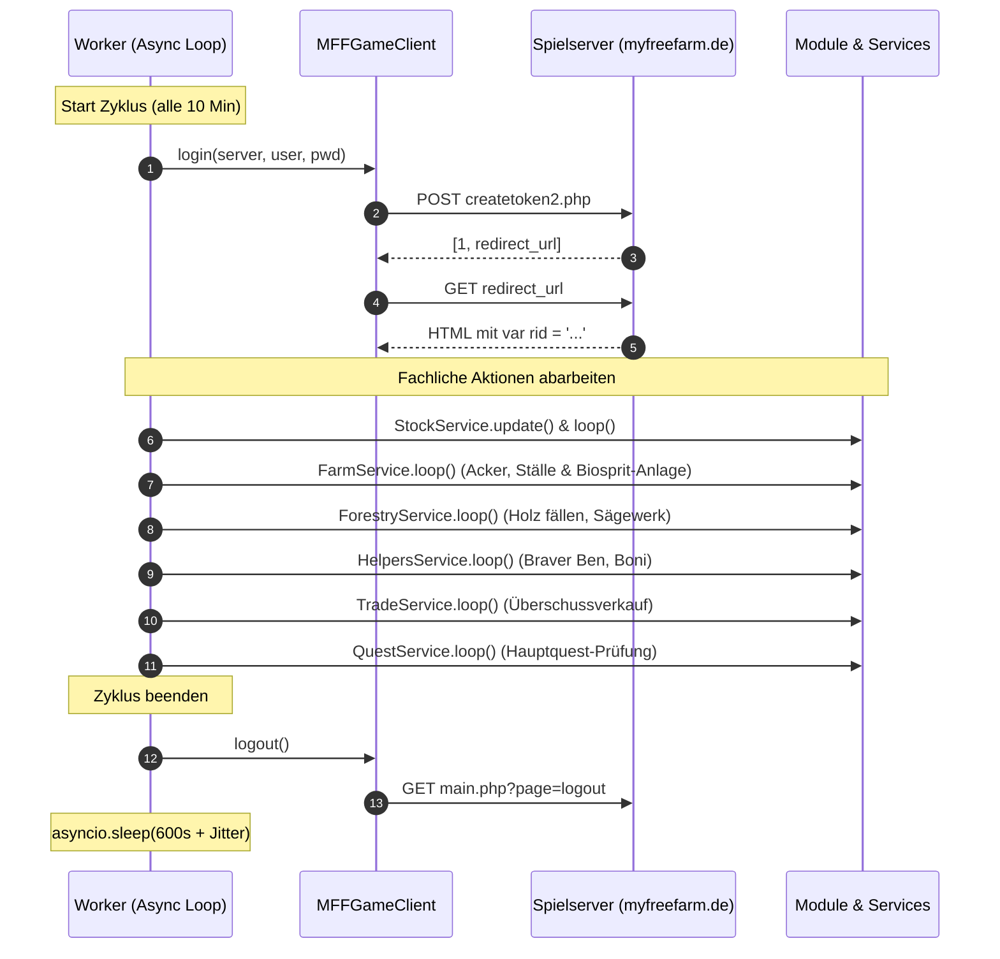

# Python Worker, Scheduler & Anti-Ban Resilienz

Dieses Dokument spezifiziert die **Ablaufsteuerung des Single-Account Workers**, das **Session- und RID-Management**, **Anti-Detection-Maßnahmen** und die **deterministische Offline-Testarchitektur**.

---

## 1. Single-Account 10-Minuten Worker-Architektur

Der Worker steuert genau einen Spieleraccount auf einem dedizierten Spielserver. Er orientiert sich an der bewährten Sequenz des Node.js-Vorbilds (`index.js`), nutzt jedoch native `asyncio`-Strukturen und ein sauberes Exception-Handling.

### 1.1 Ablaufdiagramm des 10-Minuten-Zyklus



### 1.2 Warum Logout nach jedem Zyklus?
Das Abmelden (`logout()`) nach jedem Durchlauf verhindert:
- Geister-Sitzungen und serverseitige Session-Timeouts.
- Verdächtiges Dauer-Online-Verhalten (menschliche Spieler schließen nach ihren Erledigungen den Tab).
- RID-Invalidierungsfehler während der 10-Minuten-Wartezeit.

### 1.3 FastAPI Lifespan & WorkerScheduler Orchestrierung
In Python wird der Worker durch die Klasse `WorkerScheduler` (`app/worker/scheduler.py`) gesteuert:
- **FastAPI Lifespan Integration:** Der Scheduler startet automatisch als asyncio-Task im Hintergrund, sobald die FastAPI-Anwendung hochfährt (`app.main.lifespan`), und wird beim Herunterfahren sauber gestoppt.
- **Zustandsautomat:** Der Scheduler durchläuft die Zustände `IDLE`, `RUNNING` und `SLEEPING`.
- **Echtzeit-Broadcasting:** Bei jedem Statuswechsel und sekündlich während der Ruhepause sendet der Scheduler Status- und Countdown-Events an alle über `/ws/live` verbundenen Dashboard-Clients.
- **On-Demand Sofortstart:** Über `POST /api/v1/bot/trigger` kann ein Durchlauf außerhalb des 10-Minuten-Takts sofort angestoßen werden.
- **Zustands-Cache für REST-Endpunkte:** Der Scheduler speichert Referenzen auf die Live-Instanzen (`last_stock_service`, `last_farm_service`, `last_forestry_service`, etc.), sodass GET-Routen (`/api/v1/farms`, `/api/v1/stock`, `/api/v1/contracts`) blitzschnell aus dem Arbeitsspeicher bedient werden.

---

## 2. Session- & RID-Management (`app/core/client.py`)

### 2.1 2-Schritt Login
1. **Token anfordern:** `POST https://www.myfreefarm.de/ajax/createtoken2.php`
   - Parameter: `server`, `username`, `password`, `ref=frbek`, `retid=`
   - Antwort: `[1, "https://sX.myfreefarm.de/login.php?token=..."]`
2. **Redirect folgen:** `GET https://sX.myfreefarm.de/login.php?token=...`
   - Aus dem Antwort-HTML wird die Session-ID extrahiert:
     `var rid = '([a-f0-9]+)';`
3. **Session-Validierung:** Nachfolgende Calls erhalten den Query-Parameter `?rid={rid}`.

### 2.2 Re-Login & Session-Recovery
Sollte der Server während eines Zyklus `SessionExpiredError` oder eine Login-Weiterleitung melden:
1. Der Client führt sofort einen Re-Login durch (maximal 3 Versuche mit Exponential Backoff: 2s, 4s, 8s).
2. Der fehlgeschlagene Call wird nach erfolgreichem Re-Login mit der neuen RID automatisch wiederholt.
3. Erst wenn alle 3 Versuche scheitern, bricht der Zyklus ab und der Worker wartet bis zum nächsten 10-Minuten-Fenster.

---

## 3. Anti-Detection & Resilienz

Um Account-Sperren zu verhindern, simuliert die Python-Engine menschliches Nutzungsverhalten:

### 3.1 Randomisierter Request-Jitter
Vor jedem AJAX-Aufruf wird eine zufällige Verzögerung eingefügt:
```python
# Anti-Detection Jitter: Gleichverteilung zwischen 350ms und 900ms
delay = random.uniform(0.35, 0.90)
await asyncio.sleep(delay)
```

### 3.2 Modul-Mikropausen
Zwischen größeren Aktionen (z.B. Wechsel vom Ackerbau zum Tierstall) wartet der Worker 1,5 bis 3,5 Sekunden. Kein Mensch klickt innerhalb von 50 Millisekunden durch 5 verschiedene Farm-Bereiche.

### 3.3 Wartungsmodus-Erkennung (Maintenance Backoff)
Wenn MyFreeFarm Wartungsarbeiten durchführt (HTTP 503 oder Maintenance-HTML):
- Der Worker geht für **15 bis 30 Minuten** in den Ruhemodus, anstatt alle 10 Minuten Server-Fehler zu provozieren.
- Ein aussagekräftiger Warnhinweis wird im Dashboard geloggt.

### 3.4 Globaler Circuit-Breaker (`app/core/circuit_breaker.py`)
Zum Schutz vor Account-Sperren, Captchas und Rate-Limits schützt ein globaler Circuit-Breaker alle ausgehenden Requests:
- **Zustände:** `CLOSED` (Normalbetrieb), `OPEN` (Gesperrt nach Fehlerschwelle oder Bot-Erkennung), `HALF_OPEN` (Probeaufruf nach Cooldown).
- **Sofortige Auslösung (Instant-Trip):**
  - Upstream meldet HTTP 429 (Too Many Requests).
  - Upstream liefert Plain-Text `"failed"` anstelle von JSON (Upjers Rate-Limit/Session-Block).
  - Captcha-Abfrage erforderlich ("Sicherheitsüberprüfung: Bitte Captcha lösen").
  - Account-Sperre ("Melde dich bitte beim Support").
- **Schwellenwerte & Cooldown:** Konfigurierbar (Standard: 3 aufeinanderfolgende Fehler, 900s Cooldown).
- **Scheduler-Integration:** Bei offenem Circuit-Breaker pausiert der Scheduler (`PAUSED_CIRCUIT_BREAKER`) automatisch und verhindert weitere Requests.
- **Entsperrung & Reset:** Erfolgt automatisch nach Ablauf des Cooldowns (Probe-Request) oder manuell über das Dashboard bzw. `POST /api/v1/bot/circuit-breaker/reset`.

---

## 4. Offline-Testing & Mocking-Architektur (`respx`)

Um die gesamte Logik (Ackerbau, Futter-Solver, Grasping, Handel) schnell, deterministisch und **ohne echtes Spielkonto** zu testen, kommt `respx` zum Einsatz.

### 4.1 Mock-Setup (`tests/conftest.py`)

```python
import pytest
import respx
import httpx


@pytest.fixture
def mock_game_api():
    """Mockt alle Upstream-Endpunkte von myfreefarm.de."""
    with respx.mock(assert_all_called=False) as respx_mock:
        # 1. Login Token Mock
        respx_mock.post("https://www.myfreefarm.de/ajax/createtoken2.php").mock(
            return_value=httpx.Response(
                200, 
                json=[1, "https://s1.myfreefarm.de/login.php?token=test_token_123"]
            )
        )

        # 2. Login Redirect & RID Mock
        respx_mock.get("https://s1.myfreefarm.de/login.php?token=test_token_123").mock(
            return_value=httpx.Response(
                200, 
                text="<html><script>var rid = 'abc123def456';</script></html>"
            )
        )

        # 3. GardenInit Mock (120 Felder, Karotten reif auf Feld 1)
        respx_mock.post("https://s1.myfreefarm.de/ajax/farm.php?rid=abc123def456").mock(
            return_value=httpx.Response(
                200,
                json={
                    "datablock": [
                        1,
                        {
                            "1": {"phase": 4, "remain": 0, "iswater": 1, "harvest": 17},
                            "2": {"phase": 1, "remain": 300, "iswater": 0, "harvest": 17},
                        }
                    ],
                    "updateblock": {
                        "stock": {"stock": {1: {}}, "tempstock": {}}
                    }
                }
            )
        )
        yield respx_mock
```

### 4.2 Beispiel-Integrationstest

```python
import pytest
from app.core.client import MFFGameClient


@pytest.mark.asyncio
async def test_client_login_and_api_call(mock_game_api):
    client = MFFGameClient(server=1, username="TestUser", password="SecretPassword")
    
    # 1. Login testen
    success = await client.login()
    assert success is True
    assert client.rid == "abc123def456"

    # 2. Api Call testen
    data = await client.api_call("farm", {"mode": "gardeninit", "farm": 1, "position": 1})
    assert data["datablock"][0] == 1
    assert data["datablock"][1]["1"]["phase"] == 4
```

---

## 5. Verwandte Dokumente

- [**12-python-redesign-spec.md**](12-python-redesign-spec.md): Gesamtarchitektur & 5-Phasen-Plan.
- [**13-python-models-and-algorithms.md**](13-python-models-and-algorithms.md): Pydantic v2 Modelle & Solver-Algorithmen.
- [**15-python-fastapi-api-and-dashboard.md**](15-python-fastapi-api-and-dashboard.md): FastAPI REST-API, WebSockets & Dashboard.
- [**11-external-game-api.md**](11-external-game-api.md): Detaillierte Liste aller Upstream-AJAX-Endpunkte.
