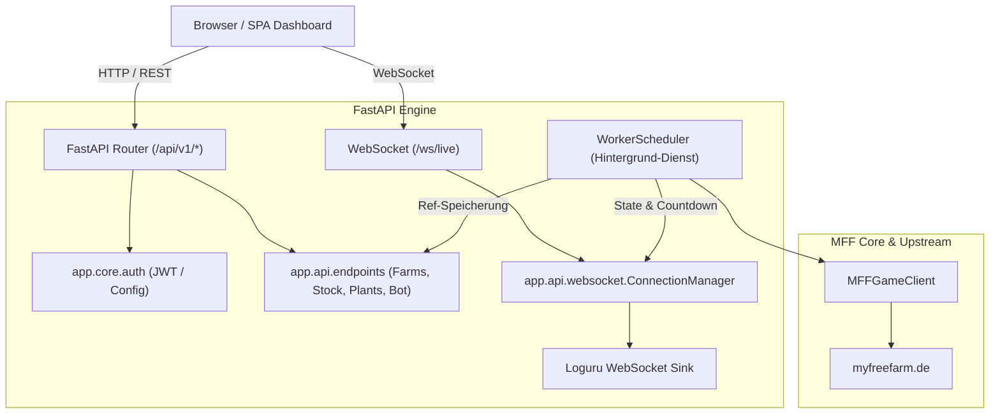

# Python FastAPI REST-API, WebSockets & Dashboard

Dieses Dokument spezifiziert die **Web- und API-Architektur** des Python-Redesigns: die REST-Endpunkte unter `/api/v1/*`, das JWT-Sicherheitsmodell, das Realtime-Streaming via WebSockets und das integrierte Single-Page Web-Dashboard.

---

## 1. Architektur-Übersicht



### 1.1 Kern-Entwurfsprinzipien
1. **Volle Abwärtskompatibilität:** Die REST-Endpunkte unter `/api/v1/*` spiegeln die Schnittstellen des ursprünglichen Node.js/Express-Backends wider, sodass bestehende Dashboards weiterfunktionieren.
2. **Eigenständiges Integriertes Dashboard:** Neben reinen JSON-Endpunkten liefert die FastAPI-Anwendung unter `/` bzw. `/dashboard` ein eigenständiges, modernes Dashboard aus (`app/static/index.html`).
3. **Reaktive Echtzeit-Logs:** Loguru-Logs werden in Echtzeit ohne Polling über WebSockets (`/ws/live`) an verbundene Dashboard-Clients gestreamt.
4. **Keine Datenbankabhängigkeit (Stateless / In-Memory):** Alle Statusdaten werden aus den Live-Diensten des letzten Scheduler-Zyklus und den Konfigurations-Singletons bezogen.

---

## 2. Authentifizierung & Autorisierung (`app/core/auth.py`)

### 2.1 Konfiguration & Credentials
Die Zugangsdaten für das Dashboard werden über Umgebungsvariablen (`Settings` in `app/config.py`) definiert:
- `MFF_API_USERNAME`: Standardmäßig `"mff"`
- `MFF_API_PASSWORD`: Standardmäßig `"M3rh4b4@mff"`
- `MFF_API_SECRET_KEY`: Geheimer Schlüssel zur Signierung der JWTs (Standard: `"mff-secret-key-change-in-production"`)
- `MFF_API_ALGORITHM`: `"HS256"`
- `MFF_API_ACCESS_TOKEN_EXPIRE_MINUTES`: `1440` (24 Stunden)

### 2.2 JWT-Token Generierung & Multi-Channel Validierung
- **Token-Erstellung:** `create_access_token(data: dict) -> str` erzeugt ein signiertes JWT mit Ablaufzeit (`exp`).
- **Flexible Token-Übergabe:** Die Dependency `get_current_user` unterstützt zwei Übergabewege:
  1. **HTTP Authorization-Header:** `Authorization: Bearer <token>` (Standard für REST-Calls)
  2. **Query-Parameter:** `?token=<token>` (Unverzichtbar für WebSockets, da Browser-WebSocket-Clients keine benutzerdefinierten Header im Handshake setzen können).
- **Abwärtskompatibler Login-Endpunkt (`POST /api/v1/login`):**
  - Akzeptiert sowohl JSON-Payloads `{"username": "...", "password": "..."}` als auch `OAuth2PasswordRequestForm` (`application/x-www-form-urlencoded`).
  - Antwortformat:
    ```json
    {
      "access_token": "eyJhbGciOiJIUzI1Ni...",
      "token_type": "bearer",
      "accessToken": "eyJhbGciOiJIUzI1Ni...",
      "expires_in": 86400
    }
    ```
    Durch das Vorhandensein von `access_token` (FastAPI/OAuth2) und `accessToken` (Express Legacy) arbeiten moderne und alte Frontends ohne Anpassung.

---

## 3. REST-API Spezifikation (`app/api/endpoints/`)

Alle Endpunkte sind vollständig über Pydantic v2 Schemas typisiert und unter `/api/v1` gebündelt:

| Methode | Pfad | Auth | Zweck & Beschreibung |
| :--- | :--- | :--- | :--- |
| `POST` | `/api/v1/login` | Öffentlich | Erzeugt JWT Access-Token aus Username & Password. |
| `GET` | `/api/v1/health` | Öffentlich | Healthcheck (`{"status": "ok"}`). |
| `GET` | `/api/v1/plants` | JWT | Liste aller Pflanzen im Spiel mit Filtern (`?category=v`, `?search=...`). |
| `GET` | `/api/v1/plants/{pid}` | JWT | Detailinformationen zu einer Pflanze (Wachstumszeit, Ertrag, Preise). |
| `GET` | `/api/v1/farms` | JWT | Status aller aktiven Farmen, Äcker, Kacheln und Gebäude. Jede Farm liefert ihr `category`-Attribut (`v`, `ex`, `alpin`, `water`, `spice`). |
| `PUT` | `/api/v1/farms` | JWT | Aktualisiert Zielpflanzen (`farm_crops`) im Speicher mit Validierung gegen die Farm-Kategorie. |
| `GET` | `/api/v1/stock` | JWT | Lagerübersicht: Guthaben in kT, Anzahl Artikel, Bestandsliste. |
| `GET` | `/api/v1/stock/orders` | JWT | Konfigurierte Mindestlagerbestände / Nachkaufregeln. |
| `PUT` | `/api/v1/stock/orders` | JWT | Aktualisiert Mindestbestände im Speicher. |
| `GET` | `/api/v1/offers` | JWT | Aktive Verkaufsregeln für den Marktplatz. |
| `PUT` | `/api/v1/offers` | JWT | Aktualisiert Verkaufsregeln & schaltet Markthandel dynamisch ein/aus. |
| `GET` | `/api/v1/contracts` | JWT | Offene Verträge mit Prüfung der Lieferfähigkeit aus Lagerbestand (`ready`). |
| `PUT` | `/api/v1/contracts` | JWT | Aktualisiert Vertragseinstellungen. |
| `GET` | `/api/v1/forestry/stock` | JWT | Holz- und Möbelbestände der Forstwirtschaft. |
| `GET` / `PUT` | `/api/v1/forestry/orders` | JWT | Mindestbestände für Holzwaren. |
| `GET` | `/api/v1/farmersmarket` | JWT | Live-Status Bauernmarkt: Gärtnerei-Slots, Blumenbeete, Schau-Slots, Farmis, Zucht. |
| `GET` / `PUT` | `/api/v1/farmersmarket/settings` | JWT | Konfiguration des Bauernmarkt-Moduls (Gärtnerei, Blumen, Farmi-Verkauf). |
| `GET` | `/api/v1/foodworld` | JWT | Live-Status Foodworld: 4 Küchenbuden, Produktionsslots, Tische, Farmis, Gerichte, Lagerbestände. |
| `GET` / `PUT` | `/api/v1/foodworld/settings` | JWT | Konfiguration der Foodworld (50er Puffer, Tischfreischaltung, Marktexport bei Leerstand). |
| `GET` / `PUT` | `/api/v1/foodworld/orders` | JWT | Legacy-Bestellregeln für die Foodworld. |
| `GET` / `PUT` | `/api/v1/fuelstation` | JWT | Live-Status Biosprit-Anlage (Farm 4) mit Slots, Punkten & Automationseinstellungen (Auto-Harvest, Auto-Refill, Min-Reserve, globale & slot-spezifische Präferenzen). |
| `GET` | `/api/v1/bot/status` | JWT | Status des Schedulers (`RUNNING`, `SLEEPING`, `IDLE`, letzter/nächster Lauf, Statistiken). |
| `POST` | `/api/v1/bot/trigger` | JWT | Löst sofort einen asynchronen Bot-Zyklus außerhalb des 10-Minuten-Takts aus. |

---

## 4. WebSocket Echtzeit-Streaming (`app/api/websocket.py`)

### 4.1 Verbindungsaufbau & Handshake
- **Pfad:** `/ws/live?token=<jwt_token>`
- **Sicherheit:** Beim Verbindungsaufbau wird das Token validiert; ungültige Tokens werden mit WebSocket Close-Code `1008` (Policy Violation) abgelehnt.
- Nach erfolgreichem Handshake sendet der Server sofort den aktuellen Bot-Status:
  ```json
  {
    "type": "status",
    "is_running": true,
    "state": "SLEEPING",
    "next_run_seconds": 580
  }
  ```

### 4.2 Loguru WebSocket Sink
In `app/api/websocket.py` ist eine dedizierte Sink-Funktion für Loguru definiert:
```python
def loguru_websocket_sink(message):
    record = message.record
    event = {
        "type": "log",
        "timestamp": record["time"].strftime("%H:%M:%S"),
        "level": record["level"].name,
        "module": record["name"],
        "line": record["line"],
        "message": record["message"],
    }
    # Asynchrones Broadcasting an alle verbundenen WebSockets
    asyncio.run_coroutine_threadsafe(ws_manager.broadcast_json(event), loop)
```
Damit sieht der Benutzer im Dashboard jeden Loglevel-Eintrag (DEBUG, INFO, WARNING, ERROR) sofort, ohne die Seite neu laden oder CLI-Logs öffnen zu müssen.

### 4.3 Heartbeat & Countdown-Streaming
Der `WorkerScheduler` sendet periodisch (sekündlich während der Ruhepause) Countdown-Events:
```json
{
  "type": "countdown",
  "remaining_seconds": 412,
  "formatted": "06:52"
}
```

---

## 5. Single-Page Web-Dashboard (`app/static/index.html`)

Das Web-Dashboard ist eine reaktive, in sich geschlossene HTML5/Tailwind-CSS Webanwendung ohne externe Build-Pipelines.

### 5.1 Komponenten & Aufbau
1. **Statusleiste (Header) & Sicherheitsbanner:**
   - Live-Indikator: Farbige Badges (`RUNNING` = Gelb pulsierend, `SLEEPING` = Grün, `IDLE` = Grau, `CIRCUIT_BREAKER` = Rot pulsierend).
   - Countdown-Timer: Zeigt verbleibende Zeit bis zum nächsten Zyklus an.
   - Sofortstart-Button ("⚡ Sofort starten"): Ruft `POST /api/v1/bot/trigger` auf.
   - Circuit-Breaker Banner: Rotes Notfallbanner bei blockierter API (Rate-Limit / Captcha / Sperre) inklusive Button "Circuit-Breaker zurücksetzen" (`POST /api/v1/bot/circuit-breaker/reset`).
   - Quick-Stats: Aktueller Kontostand in Bar-kT und Gesamtartikel im Lager.
2. **Reaktive Tabs:**
   - **Tab 1: Farmen & Ackerflächen:**
     - Übersicht über alle Farmen (Farm 1 bis 10) mit Kachelübersicht und Fortschrittsbalken für alle Äcker.
     - Kategoriespezifische Dropdowns pro Farm (`PUT /api/v1/farms`) – filtert automatisch nach `v`, `ex`, `alpin`, `water` oder `spice`.
   - **Tab 2: Live-Konsole:**
     - Scrollbarer Log-Viewer mit Farbkennzeichnung nach Loglevel.
     - Toggle für "Autoscroll" und Filter nach Loglevel (Alle, Info, Fehler).
     - Leeren- und Pausieren-Buttons.
   - **Tab 3: Lagerbestand:**
     - Durchsuchbare Tabelle aller gelagerten Produkte mit ID, Name, Menge und Marktwert.
   - **Tab 4: Konfiguration:**
     - Schalter für automatischen Handel (`trade.enabled`).
     - Mindestguthaben-Schutz (`min_credit_kt`).
     - Einstellungen für Spezialmodule (Bauernmarkt, Foodworld-Puffer & Marktexport).
   - **Tab 5: Gewürzhaus (Farm 10):**
     - Statusübersicht: Freigeschaltete Mahl- und Trockenslots, fertige Produkte, Kundenwünsche.
     - Manuelle Ernte-Aktion und Konfiguration (z. B. automatisches Nachfüllen, Trockenöfen, Mühlen).
   - **Tab 6: Biosprit-Anlage (Farm 4):**
     - Tankvolumen, Ausbaustufe, aktuelle Produktions-Slots mit Fortschritt und Tankmarken-Zähler.
     - Einstellungen für Rohstoffeinzahlung, Max-Punkte-Limite und automatische Ernte.
   - **Tab 7: Spielerverträge (Contracts):**
     - Tabellarische Verwaltung aller aktiven und geplanten Spielerverträge.
     - Interaktives Anlegen, Bearbeiten (Empfänger, Produkt-ID, Menge, Stückpreis) und Löschen von Verträgen mit direkter Synchronisation in die User-Settings.

---

## 6. Verifikation & Qualitätssicherung

Die Implementierung ist mit 81 dedizierten Offline-Unit- und Integrationstests abgesichert:
- **`tests/test_api_auth.py`:** Testet Login-Erfolg, falsche Passwörter, Token-Dekodierung und 401 bei unauthentifizierten Anfragen.
- **`tests/test_api_endpoints.py`:** Testet alle REST-Routen (`/plants`, `/farms`, `/stock`, `/offers`, `/contracts`, `/fuelstation`, `/bot/trigger`).
- **`tests/test_websocket.py`:** Testet WebSocket-Verbindungsaufbau, Authentifizierung, Ping/Pong und JSON-Broadcasting.
- **`tests/test_agriculture.py`:** Testet Farm-Kategorieregeln (`alpin`, `water`, `ex`, `spice`), Ernte, Anbau, Gießen sowie Priorisierung von Saatgut aus farm-spezifischen Regalen (`stock[farm_id]`).
- **`tests/test_fuelstation.py`:** Testet Biosprit-Status, Ernte, Punktelimits nach Slot-Level (1M–5M Punkte), Teilbefüllungen (`entries`) und Multi-Rohstoff-Einwurf.
- **`tests/test_farmersmarket.py`:** Testet Gärtnerei-Slots, Blumenbeete, Schau-Slots und Farmi-Verkauf.
- **`tests/test_foodworld.py`:** Testet 4 Küchen, Ernte, Rezeptkochen, Gästeplatzierung, Abkassieren und Marktexport bei Leerstand.

Alle 81 Offline-Tests laufen vollständig fehlerfrei durch:
```bash
uv run pytest -m "not live"
uv run ruff check app tests
```

---

## 7. Verwandte Dokumente

- [**00-README.md**](00-README.md): Gesamtinhaltsverzeichnis des Wikis.
- [**10-express-routes-api.md**](10-express-routes-api.md): Ursprüngliche Express REST-API Spezifikation.
- [**12-python-redesign-spec.md**](12-python-redesign-spec.md): Python-Zielarchitektur und Migrationsphasen.
- [**14-python-worker-and-scheduler.md**](14-python-worker-and-scheduler.md): Worker-Loop, Session-Handling & Scheduler.
