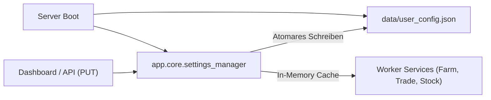

# Python Phasenplan: Erweiterungsmodule & Verbleibende Features (Phasen 6 – 11)

Dieses Dokument ergänzt die abgeschlossenen Phasen 1–5 ([`12-python-redesign-spec.md`](12-python-redesign-spec.md)) um einen **detaillierten, modularen Umsetzungsplan** für alle aus der ursprünglichen Node.js-Codebasis noch nicht portierten Funktionen.

Jede Phase ist als **in sich geschlossenes, unabhängiges Modul** konzipiert, sodass der Nutzer frei entscheiden kann, welche Bereiche priorisiert, umgesetzt oder ausgelassen werden sollen.

---

## 1. Entscheidungsmatrix & Phasenübersicht

| Phase | Modulbereich | Relevante Altdateien (Node.js) | Nutzen & Gameplay | Aufwand | Risiko / Nebenwirkungen | Empfehlung |
| :--- | :--- | :--- | :--- | :--- | :--- | :--- |
| **Phase 6** | **Passive Stadtgebäude**<br>(Obststand & Insektenhotel) | `stall/Stall.js`<br>`insecthotel/Insecthotel.js` | Regelmäßige passive kT- und Punktegewinne in Klein Muhstein & Dorf 2. | **Gering** (1–2 Tage) | Sehr gering (nutzt nur Überschüsse oberhalb von Puffern). | ✅ **Abgeschlossen** |
| **Phase 7** | **Bauernmarkt & Zucht**<br>(Gärtnerei, Blumen, Farmis, Zucht) | `farmersmarket/Nursery.js`<br>`FlowerArea.js`, `FlowerSlots.js`<br>`PetBreed.js`, `Farmis.js` | Blumengestecke, 36 Blumenbeete, Schau-Slots & Farmis in Dorf 2. *(Tierzucht inaktiv).* | **Mittel bis Hoch** (3–4 Tage) | Gering (vollständig isoliert, Coin-Schutz). | ✅ **Abgeschlossen** |
| **Phase 8** | **Hof-Gastronomie & Logistik**<br>(Sushi-Bar & Fahrzeuge) | `agriculture/SushiBar.js`<br>`agriculture/Vehicle.js` | Sushi-Produktion auf Farm 8 nach Quest 5, Feldreserve, Coin-Schutz. Warentransport per Trecker. | **Mittel** (2–3 Tage) | Gering (Fahrzeug erfordert vorhandene Landmaschinen auf Farmen). | 🟡 **Teil 1 (Sushi-Bar) ✅ Abgeschlossen**<br>Teil 2 (Fahrzeuge) folgt |
| **Phase 9** | **Foodworld-Restaurant**<br>(Gastronomie & Quests) | `services/FoodworldService.js`<br>`foodworld/Quests.js` | Kochen in 4 Restaurantküchen, Gäste platzieren (123% kT-Auszahlung), Marktexport bei Leerstand mit 50er Reserve, kein Tischkauf. | **Mittel bis Hoch** (3–4 Tage) | Gering (vollständig isoliert, kt-Direktgutschrift). | ✅ **Abgeschlossen** |
| **Phase 10**| **Spielerverträge & Events**<br>(Vertrags-Worker & Saison-Events) | `services/ContractService.js`<br>`events/DeliveryEvent.js` | Automatisches Erfüllen/Senden von Verträgen bei Überschuss; Teilnahme an Kalender-Liefertouren. | **Gering bis Mittel** (1–2 Tage) | Mittel bei Verträgen (feste kT-Preise & Empfänger müssen exakt konfiguriert sein). | **Mittel** |
| **Phase 11**| **Konfig-Persistenz & Sync**<br>(Disk-Storage & Dashboard) | `services/Config.js`<br>(Node `conf` / `configstore`) | Dauerhaftes Speichern aller Dashboard- & API-Änderungen auf Festplatte (`data/user_config.json`). | **Gering** (1 Tag) | Sehr gering (robuster Standard in moderner Architektur). | **Sehr hoch**<br>(Komfort & Beständigkeit) |

---

## 2. Detaillierte Spezifikation der Phasen

```mermaid
graph TD
    subgraph Bereits Abgeschlossen (Phasen 1-5)
        P1_5["Core Client, Stock, Ackerbau, Forst, Helfer, Trade, REST-API, Dashboard ✅"]
    end

    subgraph Erweiterungs-Optionen (Phasen 6-11)
        P6["Phase 6: Passive Stadtgebäude (Obststand und Insektenhotel)"]
        P7["Phase 7: Bauernmarkt-Komplex (Gärtnerei, Blumen, Tierzucht)"]
        P8["Phase 8: Hof-Gastronomie (Sushi-Bar) und Fahrzeug-Logistik"]
        P9["Phase 9: Foodworld-Gastronomie und Restaurant-Schleife"]
        P10["Phase 10: Spielerverträge-Worker und Saison-Events"]
        P11["Phase 11: Konfigurations-Persistenz (Disk Storage)"]
    end

    P1_5 --> P6
    P1_5 --> P7
    P1_5 --> P8
    P1_5 --> P9
    P1_5 --> P10
    P1_5 --> P11
```

---

### Phase 6: Passive Stadtgebäude (Obststand & Insektenhotel)

#### 6.1 Ziel & Nutzen
Automatisierte Bewirtschaftung der passiven Nebengebäude in Klein Muhstein und Teichlingen (Dorf 2). Beide Gebäude erfordern minimalen Lageraufwand und liefern verlässlich Punkte und kT.

#### 6.2 Technische Details & AJAX-Endpunkte
1. **Obststand / Marktbude (`FruitStallService`)**:
   - **Initialisierung:** `mode: "stall_init"` (lädt Füllmengen, aktive Slots und Belohnungsstatus).
   - **Slot-Pflege:** Slots mit < 50% Füllstand räumen (`mode: "stall_clear_slot"`).
   - **Befüllen:** Freie Slots mit verfügbaren Früchten der Kategorie `"ex"` (Exoten) aus Lagerbestand auffüllen (`mode: "stall_fill_slot", position: stall.position, slot: slotId, pid: pid, amount: fillsum`).
   - **Belohnung:** Wenn `stall.reward == true`: Belohnung einsammeln via `mode: "stall_get_reward", position: stall.position`.
2. **Insektenhotel (`InsecthotelService`)**:
   - **Initialisierung:** `mode: "insecthotel_init"` (lädt Futterlager, Zufriedenheit und Kasse).
   - **Futterlager:** Lagerslots auffüllen, wenn Füllstand um > 20% abgefallen ist (`mode: "insecthotel_set_stockslot", slot: id, pid: pid, amount: refill`).
   - **Kasse leeren:** Einnahmen einsammeln, wenn Geld oder Punkte > 50% des Limits erreichen (`mode: "insecthotel_collect_checkout"`).

#### 6.3 Geplante Python-Dateistruktur
- `app/modules/city/stall.py`: `FruitStallService`, Pydantic-Modelle `MarketStall`, `StallSlot`.
- `app/modules/city/insecthotel.py`: `InsecthotelService`, Pydantic-Modelle `InsectHotel`, `InsectStockSlot`.
- `app/modules/city/service.py`: `CityBuildingsService` (kombinierter Entry-Point für Stadt-Features).
- `tests/test_city_buildings.py`: Unit-Tests mit Offline-Mocks (`respx`).

---

### Phase 7: Bauernmarkt & Zucht (Gärtnerei, Blumenwiese, Tierzucht) ✅ (Abgeschlossen)

#### 7.1 Ziel & Nutzen
Vollständige Portierung des Marktplatzbereichs in Teichlingen (Dorf 2): Produktion von Blumengestecken, Anbau von Zierblumen, Aufzucht von Begleittieren und die Belieferung von Kunden.

#### 7.2 Technische Details & AJAX-Endpunkte
1. **Gärtnerei (`NurseryService`)**:
   - `mode: "nursery_init"` (Farm 1, Position 1).
   - Fertige Gestecke ernten: `mode: "nursery_harvest", slot: slotId`.
   - Neue Gestecke starten: `mode: "nursery_startproduction", id: pid, pid: pid, slot: slotId`.
2. **Blumenwiese (`FlowerService`)**:
   - `mode: "flower_init"`, `mode: "flower_crop"`, `mode: "flower_plant"`, `mode: "flower_water"`.
   - Zierblumen (Kornblumen-Sonderzüchtungen etc.) gießen und abernten.
3. **Tierzucht (`PetBreedService`)**:
   - `mode: "petbreed_init"`: Zuchtstation auslesen.
   - Zuchtergebnisse abholen: `mode: "petbreed_harvest", slot: slotId`.
   - Neue Tierzucht starten mit Werkzeugen & Zuchttieren: `mode: "petbreed_start", slot: slotId, pet: petId, tool: toolId`.
   - Tierzucht-Quests beliefern: `mode: "petbreed_send_quest"`.
4. **Bauernmarkt-Farmis (`MarketOrderService`)**:
   - Wartende Kunden am Bauernmarkt auf Profitabilität prüfen und bei Deckungsbeitrag beliefern (`farmersmarket_sellfarmi`).

#### 7.3 Geplante Python-Dateistruktur
- `app/modules/farmersmarket/nursery.py`: `NurseryService`.
- `app/modules/farmersmarket/flower.py`: `FlowerService`.
- `app/modules/farmersmarket/petbreed.py`: `PetBreedService`.
- `app/modules/farmersmarket/farmis.py`: `MarketFarmisService`.
- `app/modules/farmersmarket/service.py`: `FarmersMarketService` Orchestrator.
- `tests/test_farmersmarket.py`: Unit-Tests mit `respx`.

---

### Phase 8: Hof-Gastronomie (Sushi-Bar ✅) & Fahrzeug-Logistik (Teil 2 ✅ Abgeschlossen)

#### 8.1 Ziel & Nutzen
Erweiterung der landwirtschaftlichen Betriebe um Spezialbauten und interne Transportketten:
1. **Sushi-Bar (Teil 1 ✅ Abgeschlossen):** Vollautomatische Hof-Gastronomie auf Farm 8 (Bauplatz 23) mit Quest-5-Ausrichtung, Cross-Modul-Äcker-Bedarfsdeckung, striktem Coin-Schutz und Saatgut-Feldreserve.
2. **Fahrzeuge & Landmaschinen (Teil 2 ✅ Abgeschlossen):** Vollautomatischer Warentransport zwischen Hauptfarm (Farm 1) und Außenfarmen (5, 6, 8, 10):
   - **Automatische Wahl des schnellsten Transportmittels:** Wählt pro Route stets das Fahrzeug mit minimaler Fahrzeit (`duration`) bzw. maximaler Geschwindigkeit/Stufe (`auto_fastest: True`).
   - **Hinweg (Farm 1 $\to$ Außenfarm):** Belädt benötigte Versorgungsgüter (z. B. Kohlrabi auf Farm 5) via `StockService.grasp_products()`, solange der Außenfarmbestand unter 4000 Einheiten liegt.
   - **Rückweg (Außenfarm $\to$ Farm 1):**
     - **Prio 1 (Quest-Bedarfe):** Produkte, die für aktive Quests benötigt werden (`quest_requirements > stock`), werden vorrangig verladen.
     - **Prio 2 (Ernteüberschuss):** Überschuss oberhalb der Saatgut-Reserve ($120 / (x \times y)$).
     - **Farm-10-Sonderregel:** Auf Farm 10 werden als Ernteüberschuss **ausschließlich gemahlene Produkte** der Gewürzmühle verladen; Rohgewürze verbleiben für die Mühle vor Ort.
   - **Abfahrts-Regeln:** Vollbeladung (`remaining_capacity == 0`), Deckung eines offenen Quest-Defizits, kritischer Versorgungsbestand (< 500 Einheiten) oder `send_partial: True`.
   - **AJAX-API:** `farm.php?mode=map_sendvehicle&farm={current}&position=1&route={route}&vehicle={vehicle}&cart={cart}`.

#### 8.2 Implementierte Python-Architektur (Fahrzeuge)
- `app/models/vehicle.py`: Pydantic v2 DTOs (`VehicleState`, `VehicleConfigData`, `VehicleRouteConfig`, `VehicleCargoItem`, `VehicleInfo`).
- `app/modules/agriculture/vehicle.py`: `Vehicle` und `VehicleService`.
- `app/modules/farm_buildings/farm_service.py`: Orchestrierung und Einbindung in `update_farms()` und `loop()`.
- `app/api/endpoints/vehicles.py`: REST-API (`GET /api/v1/vehicles`, `POST /api/v1/vehicles/{route}/send`, `PUT /api/v1/vehicles/{farm_id}/config`).
- `app/static/index.html`: Responsives Dashboard-Panel für Fahrzeuglogistik mit Echtzeitstatus und manuellem Abfahrts-Trigger.
- `tests/test_vehicle.py`: 11 Unit- & Integrationstests (Parsing, Schnellstes Fahrzeug, Grasping, Quest-Priorisierung, Farm-10-Filter, Timer, Abfahrtsregeln, REST-API), alle 11/11 passing.

---

### Phase 9: Foodworld-Gastronomie & Restaurant-Schleife ✅ (Abgeschlossen)

#### 9.1 Ziel & Nutzen
Vollständige Automatisierung des Gastronomie-Bereichs in Klein Muhstein:
- **Dauerbetrieb der 4 Küchen:** Getränkebude (`DrinkBooth`, 1), Imbiss (`SnackBooth`, 2), Konditorei (`PastryShop`, 3) und Eisdiele (`IceCreamParlour`, 4) ernten und kochen kontinuierlich Gerichte.
- **Tisch- & Gästemanagement:** Freie Restaurantstühle werden sofort mit den lukrativsten Gästen besetzt (Sortierung nach `price_per_time` bzw. Ertrag). Gäste zahlen Basispreis + Trinkgeld + Restaurantbonus $\approx$ 123.5% des NPC-Werts direkt in Bar-kT (ohne 10% Marktgebühr).
- **Automatisches Abkassieren:** Fertig essende Gäste werden sofort abkassiert (`action: cash`), Geld wird direkt dem Barvermögen gutgeschrieben.
- **Regeln & Schutzmechanismen (Nutzer-Constraints):**
  - **Kein Tischkauf:** Tische werden nicht automatisch freigeschaltet (`auto_unlock_tables = False`).
  - **Feste Gerichtsreserve:** Pro Speise verbleibt ein konfigurierbarer Puffer von standardmäßig 50 Stück (`dish_reserve_buffer = 50`) im Lager für Restaurantgäste und Quests.
  - **Markt-Export nur bei Angebotsleerstand:** Überschüsse der Kategorie `fw` (PIDs 130–169 und 450–485) oberhalb der 50er Reserve werden an den Markt übergeben, aber **ausschließlich dann, wenn aktuell kein einziges Angebot für diesen Artikel auf dem Markt existiert** (`only_empty_market = True`), um Preiskämpfe zu verhindern.
  - **Level-Strategie:** Die Millionen erwirtschafteter kT dienen als primärer Treibstoff für Quests und High-XP-Pflanzen auf den 28 Äckern.

#### 9.2 Technische Details & AJAX-Endpunkte
- **Kommando-Endpunkt:** `https://s{server}.myfreefarm.de/ajax/foodworld.php`
- `action: "foodworld_init", id: 0, table: 0, chair: 0`: Status der 4 Küchen, Tische, Stühle, Farmis und Rezepte laden.
- `action: "crop", id: 0, table: buildingId, chair: slotId`: Fertig gekochte Speisen abholen.
- `action: "production", id: recipeId, table: buildingId, chair: slotId`: Kochen starten (Rezept nach Mindestreserve/Zutatenverfügbarkeit).
- `action: "dropped", id: farmiId, table: tableId, chair: chairId`: Gast an freien Stuhl platzieren.
  - *Wichtig:* Tische sind im Upstream 0-indiziert (`0..num_tables-1`), Stühle 1-indiziert (`1..chairs_per_table`).
- `action: "cash", id: 0, table: tableId, chair: chairId`: Rechnung kassieren (Gutschrift Basis + Tip + Bonus direkt in kT).

#### 9.3 Implementierte Python-Architektur
- `app/modules/foodworld/models.py`: Pydantic v2 DTOs (`KitchenBuilding`, `KitchenSlot`, `TableChair`, `FoodworldFarmi`, `FoodworldRecipe`, `FoodworldSettings`, `FoodworldSummary`).
- `app/modules/foodworld/kitchen.py`: Küchen-, Slot- und Rezeptverwaltung (`KitchenService`).
- `app/modules/foodworld/tables.py`: Tisch-, Platzierungs- und Abrechnungsservice (`TableService`).
- `app/modules/foodworld/service.py`: `FoodworldService` (Haupt-Orchestrator mit 50er Pufferprüfung und Marktexport bei Leerstand).
- `app/api/endpoints/foodworld.py`: REST-API für Live-Status (`GET /api/v1/foodworld`) und Einstellungen (`GET/PUT /api/v1/foodworld/settings`).
- `tests/test_foodworld.py`: 8 Unit- & Integrationstests mit Offline-Mocks (`respx`). Live-verifiziert auf Server 21.

---

### Phase 10: Spielerverträge-Worker & Saison-Events

#### 10.1 Ziel & Nutzen
1. **Automatisierte Spielerverträge:** Konfigurierte Verträge mit befreundeten Spielern oder Neben-Accounts werden automatisch versendet, sobald die Lagerbestände über den Mindestreserven liegen.
2. **Saisonale Liefer-Events:** Periodisch stattfindende Spiel-Events (z. B. Erntedank, Halloween, Oster-Liefertouren) werden automatisch bedient.

#### 10.2 Technische Details & AJAX-Endpunkte
1. **Vertrags-Service (`ContractWorkerService`)**:
   - Auslesen offener Verträge via `mode: "getfarms"`.
   - Bei Erreichen der Mindestmenge: Vertrag automatisch absenden via:
     `action: "contracts_send", name: receiver, opt1: receiver, cart: "{pid}_{amount}_{price}_0|"`
2. **Saison-Events (`DeliveryEventService`)**:
   - Event-Status abrufen: `mode: "deliveryevent_init"`.
   - Wenn Tour beendet und Event-Punkte ausreichen: Nächste Tour starten via `mode: "deliveryevent_starttour", spot: spotId`.

#### 10.3 Geplante Python-Dateistruktur
- `app/modules/contracts/worker.py`: `ContractWorkerService`.
- `app/modules/events/delivery.py`: `DeliveryEventService`.
- `tests/test_contracts_events.py`.

---

### Phase 11: Dauerhafte Konfigurations-Persistenz & Dashboard-Sync

#### 11.1 Ziel & Nutzen
Bisher werden Einstellungsänderungen (Zielpflanzen pro Farm `farm_crops`, Markthandel An/Aus `trade.enabled`, Mindestreserven) im Arbeitsspeicher gehalten. Ein Neustart des Python-Servers setzt sie auf die Defaults der `.env` zurück.
**Ziel von Phase 11:**
- Dauerhaftes Speichern aller Änderungen in einer lokalen JSON/YAML-Konfigurationsdatei (z. B. `data/user_config.json`).
- Nahtloser Sync mit dem Dashboard (Änderungen im Dashboard bleiben nach Server-Neustart erhalten).
- Keine relationale Datenbank nötig: schlanke, robuste Datei-Persistenz mit atomarem Schreiben (`write_temp` + `atomic_rename`).

#### 11.2 Technische Details & Architektur

1. **`SettingsManager` (`app/core/settings_manager.py`)**:
   - Lädt beim Booten `data/user_config.json`.
   - Falls nicht vorhanden: Initialisiert Defaults aus `Settings` (`app/config.py`).
   - Bei jedem `PUT`-Aufruf: Aktualisiert Memory-State und schreibt atomar nach `data/user_config.json`.
2. **Betroffene Endpunkte**:
   - `PUT /api/v1/farms` (Zielpflanzen pro Farm)
   - `PUT /api/v1/offers` (Trade ein/aus, Batchgrößen)
   - `PUT /api/v1/stock/orders` (Mindestlagerbestände)
   - `PUT /api/v1/forestry/orders` (Holzwirtschaft-Grenzwerte)

#### 11.3 Geplante Python-Dateistruktur
- `app/core/settings_manager.py`: Atomarer JSON-Settings-Manager.
- Integration in bestehende FastAPI Router (`app/api/endpoints/*.py`).
- `tests/test_settings_persistence.py`.

---

## 3. Empfohlene Umsetzungsreihenfolge (Priorisierungsvorschlag)

Falls du schrittweise vorgehen möchtest, empfiehlt sich folgende Reihenfolge:

1. **Top-Empfehlung 1: Phase 11 (Konfig-Persistenz)**
   - **Begründung:** Sorgt dafür, dass deine Farm-Zuweisungen (z. B. Farm 1 & 3: Kornblumen, Farm 4: Chili) und Handels-Toggles einen Server-Neustart dauerhaft überstehen. Schneller und sauberer Nutzen für das gesamte System.
2. **Top-Empfehlung 2: Phase 6 (Obststand & Insektenhotel)**
   - **Begründung:** Sehr geringer Implementierungsaufwand (nur 2 kleine Klassen), kein Risiko für den Account, liefert sofort verlässliche passive kT und Punkte.
3. **Nach individuellem Bedarf: Phasen 7, 8, 9, 10**
   - Hängt direkt von deinem aktuellen Spielstand auf Server 21 ab (hast du die Sushibar / Gärtnerei / Tierzucht / Foodworld freigeschaltet und möchtest du diese automatisiert bespielen lassen?).

---

## 4. Verwandte Dokumente

- [**00-README.md**](00-README.md): Gesamtinhaltsverzeichnis des LLM-Wikis.
- [**12-python-redesign-spec.md**](12-python-redesign-spec.md): Grundlegende Python-Zielarchitektur und Phasen 1–5.
- [**06-module-farmersmarket.md**](06-module-farmersmarket.md): Technische Altdokumentation des Bauernmarkts.
- [**07-module-stall.md**](07-module-stall.md): Technische Altdokumentation des Obststandes.
- [**08-module-misc.md**](08-module-misc.md): Technische Altdokumentation von Insektenhotel, Foodworld und Events.
- [**03-module-agriculture.md**](03-module-agriculture.md): Technische Altdokumentation von Sushibar und Fahrzeugen.
