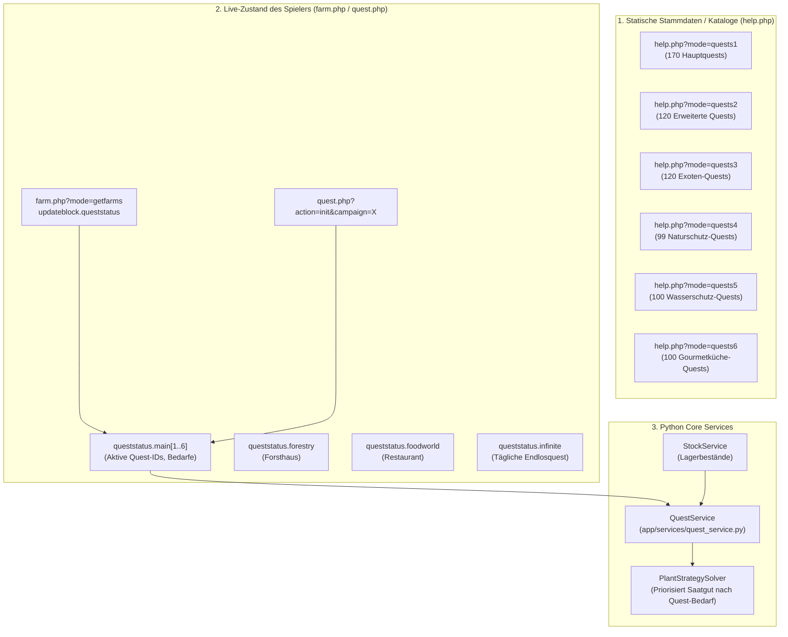

# Questsystem & Questreihen in MyFreeFarm

Das Questsystem ist eines der zentralen Progressions- und Automatisierungselemente in MyFreeFarm. Es steuert die Freischaltung neuer Farmen, Bauplätze, Gebäude, Pflanzen und Boni.

---

## 1. Systemarchitektur & Zweiteilung des Questsystems

In MyFreeFarm existiert eine strikte Trennung zwischen **Stammdaten-Katalogen** (welche Quests existieren, was wird benötigt, welche Belohnung gibt es?) und dem **Live-Status des Spielers** (bei welcher Quest ist der Account gerade, welche Produkte wurden bereits eingezahlt?):



---

## 2. Die 6 Hauptquestreihen im Überblick

MyFreeFarm unterteilt die Hauptquests in **6 eigenständige Kampagnen (Reihen)** mit insgesamt **709 Quests**:

| Reihe | Kampagnen-ID | Name / Thema | Zugeordnete Farm / Bereich | Anzahl Quests | Wichtige Meilensteine & Belohnungen |
| :---: | :---: | :--- | :--- | :---: | :--- |
| **1** | `1` | **Hauptquestreihe 1** | Farm 1–4 (Hauptfarmen) | **170** | Schaltet 2. & 3. Bauernhof frei, 2. & 3. Regal, Bauplätze, 5% Gießbonus bei Quest 170. |
| **2** | `2` | **Hauptquestreihe 2** | Farm 1–4 (Erweitert) | **120** | Große Mengen an Tierprodukten, Imkerei, fortgeschrittene Pflanzen, hohe Punktzahlen. |
| **3** | `3` | **Hauptquestreihe 3 (Exoten)** | Farm 5 (Exotenfarm) | **120** | Schaltet Ananas (PID 351) und die Exoten-Außenfarm 5 frei. |
| **4** | `4` | **Hauptquestreihe 4 (Alpen)** | Farm 6 (Bergfarm) | **99** | *Naturschutzquest*: Schaltet Spitzwegerich (PID 700) und Bergfarm 6 frei. |
| **5** | `5` | **Hauptquestreihe 5 (Wasser)** | Farm 8 (Wasserfarm) | **100** | *Wasserschutzquest*: Schaltet Wasserspinat (PID 952) und Teichfarm 8 frei. |
| **6** | `6` | **Hauptquestreihe 6 (Gewürze)** | Farm 10 (Gewürzfarm) | **100** | *Gourmetküchequest*: Schaltet Pfeffer (PID 1100), Gewürzhaus und Bauplätze 2–6 der 10. Farm frei. |

> [!NOTE]
> Zusammengenommen umfassen die 6 Hauptquestreihen exakt **709 nummerierte Quests**.

---

## 3. Schnittstellen & Datenabruf

### 3.1 Vollständiger Katalog-Abruf über `help.php`

Der Server stellt die kompletten Stammdaten aller 6 Reihen über den Service `help.php` bereit.

- **URL & Parameter:**
  ```http
  POST /ajax/help.php HTTP/1.1
  Content-Type: application/x-www-form-urlencoded

  rid={rid}&mode=quests{1..6}
  ```
- **Rückgabeformat:**
  ```json
  [
    1,
    {
      "headline": "Hauptquestreihe 6",
      "content": "<table class=\"newhelp_table\" cellspacing=\"0\" cellpadding=\"0\">...</table>"
    }
  ]
  ```
- **Struktur des HTML-Tabellen-Inhalts (`content`):**
  Jede Questzeile ist als `<tr class="newhelp_line">` formatiert mit drei Spalten:
  1. Spalte: Quest-Nummer (z. B. `1.`, `77.`).
  2. Spalte: Geforderte Waren mit Mengenangaben und PIDs (als CSS-Klassen `kp{pid}`, z. B. `<div class="kp1100"></div> 5x Pfeffer`).
  3. Spalte: Belohnungen (Punkte, Freischaltungen, Gegenstände).

### 3.2 Live-Fortschritt über `farm.php` & `quest.php`

Der aktuelle Fortschritt des Accounts für alle aktiven Reihen wird bei jedem Zyklus über `farm.php?mode=getfarms` mitgeliefert:

- **Pfad im Response:** `body.updateblock.queststatus.main`
- **Beispiel-Struktur für aktive Quests (z. B. Kampagnen 4, 5, 6 parallel aktiv):**
  ```json
  {
    "4": {
      "questid": 91,
      "data": {
        "1": [ { "708": 36619, "705": 117180 }, 0, 0, 0 ],
        "2": [ 6500000, 0, 0, 0, 0, 0, 0, 0, 0 ],
        "6": "Naturschutzquest",
        "7": "Liefere die benötigten Produkte an die Naturschutzorganisation.",
        "8": 172800,
        "12": 6
      }
    },
    "6": {
      "questid": 77,
      "data": {
        "1": [ { "21": 429057, "8": 44949 }, 0, 0, 0 ],
        "2": [ 13500000, 0, 0, 0, 0, 0, 0, 0, 0 ],
        "6": "Gourmetküchequest",
        "7": "Liefere die benötigten Gewürze an die Internationale Gourmetküche.",
        "8": 172800,
        "12": 10
      }
    }
  }
  ```
- **Schlüsselfelder in `data`:**
  - `questid`: Aktuelle Quest-Nummer innerhalb dieser Kampagne.
  - `data[1][0]`: Dictionary `{pid: amount}` der geforderten Waren.
  - `data[2][0]`: Erfahrungspunkte-Belohnung.
  - `data[6]`: Klartext-Titel der Questreihe.
  - `data[7]`: Beschreibungstext.
  - `data[8]`: Restlaufzeit (Sekunden) des Timers bis zum nächsten Quest-Reset bzw. Abgabezeitfenster.
  - `data[12]`: Farm-ID, zu der die Quest gehört (z. B. `6` für Bergfarm, `10` für Gewürzfarm).

### 3.3 Initialisierung & Kampagnen-Abruf über `quest.php`

Möchte man eine bestimmte Kampagne gezielt abfragen:
- **API-Call:**
  ```http
  POST /ajax/quest.php HTTP/1.1
  rid={rid}&action=init&campaign={1..6}&farm={farm_id}
  ```

### 3.4 Warenabgabe & Questabschluss

- **Waren abgeben:**
  ```http
  POST /ajax/quest.php HTTP/1.1
  rid={rid}&action=sendproduct&campaign={campaign_id}&pid={pid}&amount={amount}
  ```
- **Quest abschließen:**
  ```http
  POST /ajax/quest.php HTTP/1.1
  rid={rid}&action=finishquest&campaign={campaign_id}
  ```

---

## 4. Weitere spezialisierte Questsysteme

Neben den 6 Hauptquestreihen existieren in MyFreeFarm weitere Quest-Mechanismen:

1. **Forsthaus-Quests (`queststatus.forestry` / `forestry.php`):**
   - Kampagnen-ID: 2 (Forst-Kampagne).
   - Stammdaten sind direkt im Login-HTML der Desktop-Ansicht hinterlegt: `var forestry_quests = {...}`.
   - Steuerung: `action=initcampaigns` und `action=sendproduct` auf `forestry.php`.
2. **Foodworld-Quests (`foodworld.php`):**
   - Belieferung der Foodworld-Gäste und Meilenstein-Quests zur Freischaltung neuer Restaurantküchen.
   - API: `action=quest_send&quest_id={id}`.
3. **Tierzucht-Quests (`farmersmarket`):**
   - Rasse- und Zucht-Quests im Tierzuchtzentrum auf dem Bauernmarkt (`farmersmarket/PetBreed.js`).
4. **Endlosquestreihe (`queststatus.infinite`):**
   - Rollierende Quests mit täglicher Aktualisierung (`data.quest.products`, Punkte- und kT-Belohnungen).

---

## 5. Python-Architektur & Solver-Integration

In `myfreefarm_python` ist das Questsystem wie folgt verankert:

1. **Modelle (`app/models/quest.py`):**
   - `QuestRequirement`: PID, Name, benötigte Menge, aktueller Lagerbestand, noch fehlende Menge (`missing`).
   - `QuestStatus`: Quest-Nummer, Titel, Liste von Anforderungen, `is_ready` Flag.
2. **Service (`app/services/quest_service.py`):**
   - Liest `queststatus.main` ein und validiert Bestände über `StockService`.
   - Bietet Methoden zum Abruf einzelner Kampagnen (`campaign: 1..6`).
3. **Pflanz-Solver (`app/modules/agriculture/strategies.py`):**
   - `plantQuest`: Prüft für jedes Feld die passende Quest-Kategorie (z. B. auf Farm 6 nur Alpin-Bedarfe aus Kampagne 4, auf Farm 10 Gewürz-Bedarfe aus Kampagne 6).
   - Prüft bei Spezialfarmen vorab `StockService.get_farm_amount(farm_id, pid) > 0`, um Fehlversuche bei leerem Farm-Regal zu verhindern.

---

## 6. Verwandte Dokumente

- [**00-README.md**](00-README.md): Gesamtinhaltsverzeichnis des Wikis.
- [**03-module-agriculture.md**](03-module-agriculture.md): Ackerbau & Pflanz-Solver-Strategien (`plantQuest`).
- [**09-core-services-stock.md**](09-core-services-stock.md): `StockService` und Warenwirtschaft.
- [**11-external-game-api.md**](11-external-game-api.md): AJAX-Endpunkte für `help.php` und `quest.php`.
- [**13-python-models-and-algorithms.md**](13-python-models-and-algorithms.md): Mathematische Modelle und Priorisierungs-Algorithmen.
