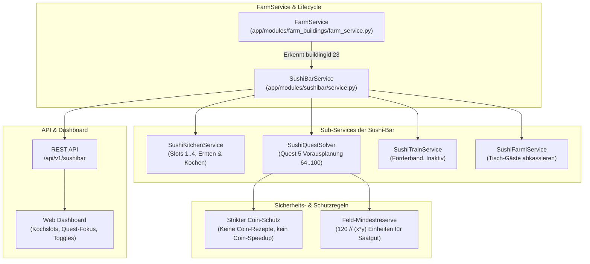

# Sushi-Bar Modul (Farm 8, Position 2)

Das `sushibar`-Modul steuert die Hof-Gastronomie auf **Farm 8 (Wasserfarm)**, Position 2 (`buildingid: 23`). Es automatisiert die Zubereitung von Spezialitäten in den Kochslots, bedient Farmi-Gäste an den Tischen und richtet die Kochplanung strikt an den Anforderungen der **Hauptquestreihe 5 (Wasserschutzquest)** aus.

---

## 1. Übersicht & Architektur

---

## 2. Spielmechanik & Endpunkte

### 2.1 AJAX-Schnittstelle (`farm.php`)

| Modus (`mode`) | Parameter | Beschreibung |
| :--- | :--- | :--- |
| `sushibar_init` | Keine | Initialisiert den Gesamtzustand der Sushi-Bar (Slots, Laufband, Farmis, Level, Konfiguration). |
| `sushibar_harvestproduction` | `slot: int, position: int` | Erntet fertige Gerichte aus einem Kochslot (z. B. Slot 1..3). |
| `sushibar_startproduction` | `slot: int, pid: int` | Startet die Zubereitung eines Rezepts in einem freien Slot. |
| `sushibar_settrainslot` | `slot: int, pid: int` | Bestückt einen freien Platz auf dem 16-teiligen Förderband (nur bei `auto_train=True`). |
| `sushibar_finishfarmi` | `slot: int` | Kassiert einen zufriedenen Farmi-Gast ab (`have >= need` und Essenszeit abgelaufen). |
| *(Gesperrt)* `sushibar_finisheat` | `slot: int` | **Strikt verboten:** Verkürzt Essenszeit gegen reale Coins. |

---

## 3. Schutzmechanismen & Nutzer-Vorgaben

### 3.1 Strikter Coin-Schutz
Im Spiel existieren 16 Rezepte, von denen exakt 8 Rezepte reale Spielmünzen (Coins) kosten (z. B. PIDs 971, 972, 975, 976, 980, 981, 983, 985).
- **Regel:** Der `SushiQuestSolver` und der `SushiKitchenService` filtern grundsätzlich alle Rezepte mit `cost_coins > 0` aus.
- Es werden ausschließlich die 8 kostenlosen kT-Rezepte zubereitet:
  - PID 970: Sommerrolle (sushi)
  - PID 973: Omelett-Rolle (sushi)
  - PID 974: Mie Kangkung (soup)
  - PID 977: Brunnenkressensuppe (soup)
  - PID 978: Brunnenkressensalat (salad)
  - PID 979: Tumis Kangkung (salad)
  - PID 982: Lotoswurzel in Honigglasur (dessert)
  - PID 984: Taro-Dampfnudeln (dessert)

### 3.2 Ausrichtung an Hauptquestreihe 5
- Der `SushiQuestSolver` parst die Quests der Reihe 5 über `help.php?mode=quests5`.
- Er liest den aktuellen Spielerfortschritt (`queststatus.main["5"].questid`, z. B. Quest 64).
- Ab dieser Questnummer sucht er chronologisch nach geforderten kT-Sushi-Rezepten (z. B. Quest 72: Brunnenkressensalat 978, Quest 74: Taro-Dampfnudeln 984 & Brunnenkressensuppe 977, Quest 83: Sommerrolle 970 usw.).
- Das früheste noch nicht im Lager vorhandene Zielrezept wird bevorzugt gekocht.

### 3.3 Feld-Bepflanzungsreserve
- Die Zutaten für Sushi stammen primär aus dem Ackerbau auf Farm 8 (Reis 950, Lotos 951, Wasserspinat 952, Taro 953, Wasserpfeffer 954, Wasserkastanie 955, Brunnenkresse 957).
- Damit der Ackerbau auf Farm 8 nicht durch Kochen lahmgelegt wird, verbleibt **dynamisch mindestens die Menge für ein volles Feld**:
  $$\text{Reserve} = \frac{120}{\text{size\_x} \times \text{size\_y}}$$
  Bei 1x1-Wasserpflanzen verbleiben also immer mindestens **120 Stück** unberührt im Lager.

### 3.4 Inaktives Förderband (Laufband)
- Die automatische Bestückung des Laufbands ist standardmäßig deaktiviert (`auto_train = False`).

### 3.5 Verknüpfung mit Ackerbau auf Farm 8 (Quest 5 Bedarfs-Solver)
- Die Wasserfelder (Äcker) auf Farm 8 unterstützen direkt die Erfüllung von Questreihe 5 (`plantQuest`-Strategie):
  1. **Direkte Quest 5 Anforderungen:** Wasserpflanzen (PIDs 950–957), die in anstehenden Quests (ab aktuellem Quest-ID) gefordert werden.
  2. **Sushi-Zutaten-Bedarf:** Wasserpflanzen, die als Zutat für anstehende Quest 5 Sushi-Gerichte (PIDs 970–985) fehlen.
- **Priorität & Saatgut-Sicherheit:**
  - Streng chronologische Sortierung nach Quest-Reihenfolge.
  - Nur Pflanzen mit vorhandenem Saatgut auf Farm 8 (`stock_service.get_farm_amount(8, pid) > 0`) werden ausgewählt. Fehlt das Saatgut für das höchstpriorisierte Ziel, rückt das nächste an.
  - Fallback auf `plantMin` (geringster Bestand), falls kein Quest-Bedarf oder Saatgut vorliegt.

---

## 4. REST-API & Schnittstellen

- `GET /api/v1/sushibar`: Liefert Status (Level, Slots, Farmis, aktives Quest-5-Ziel, Rezeptkatalog).
- `GET /api/v1/sushibar/settings`: Liefert Automationskonfiguration.
- `PUT /api/v1/sushibar/settings`: Aktualisiert Einstellungen (Toggles, Strategie).
- `POST /api/v1/sushibar/action/harvest`: Manuelles Ernten.
- `POST /api/v1/sushibar/action/serve`: Manueller Komplettdurchlauf.

---

## 5. Verwandte Dokumente

- [**00-README.md**](00-README.md): Wiki-Inhaltsverzeichnis.
- [**16-python-extension-modules-plan.md**](16-python-extension-modules-plan.md): Phasenplan für Erweiterungsmodule.
- [**17-quest-system.md**](17-quest-system.md): Spezifikation der 6 Hauptquestreihen und des Questsystems.
- [**03-module-agriculture.md**](03-module-agriculture.md): Ackerbau & Altspezifikation.
