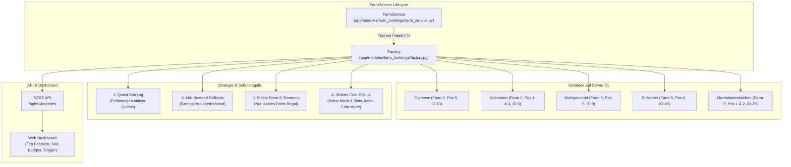

# Veredelungsfabriken-Modul (Factory)

Das `factory`-Modul steuert alle weiterverarbeitenden Gewerbe- und Veredelungsbetriebe auf den Farmen. Es automatisiert die Ernte fertiger Erzeugnisse, ermittelt das optimale Produktionsrezept anhand von Quest-Anforderungen und Lagerbeständen, schützt reale Spielmünzen (Coins) vor ungewolltem Verbrauch und beachtet die strikte Trennung lokaler Rohstoffregale auf Spezialfarmen ($\ge 5$).

---

## 1. Übersicht & Architektur

---

## 2. Spielmechanik & AJAX-Endpunkte (`farm.php`)

| Modus (`mode`) | Parameter | Beschreibung |
| :--- | :--- | :--- |
| `innerinfos` | `farm: int, position: int` | Lädt den aktuellen Status des Gebäudes (Stufe, Slots, verfügbare Rezepte). |
| `harvestproduction` | `farm: int, position: int, slot: int` | Erntet fertige Produkte aus einem Slot (`ready: 1`). Schreibt Ertrag ins Lager gut. |
| `start` | `farm: int, position: int, slot: int, item: str` | Startet die Produktion eines Rezepts (`item_id`) in einem freien Slot. |

### 2.1 Erkannte Gebäudetypen

| Building ID | Name | Typische Erzeugnisse | Rohstoffe / Zutaten |
| :--- | :--- | :--- | :--- |
| **8** | **Käserei** | Käse (PID 27), Ziegenkäse (PID 111) | Kuhmilch (PID 10), Ziegenmilch (PID 110) |
| **13** | **Ölpresse** | Maisöl (116), Rapsöl (117), Sonnenblumenöl (118), Kürbiskernöl (119), Olivenöl (120), Walnussöl (121) | Mais (2), Raps (7), Sonnenblumen (4), Kürbis (38), Oliven (42), Walnüsse (43) |
| **9** | **Wollspinnerei** | Wollknäuel (PID 28), Angorawollknäuel (PID 152) | Schafwolle (PID 11), Angorawolle (PID 151) |
| **16** | **Strickerei** | Strickpullover (155), Wollschal (156), Stricksocken (157) | Angorawollknäuel (PID 152), Wollknäuel (PID 28) |
| **25** | **Marmeladenküche** | Gelierzucker (1201), Erdbeer-Marmelade (1202), Johannisbeer-Marmelade (1203), etc. | Zuckerrüben (1200), Beeren/Früchte + Gelierzucker |
| **7** | *Mayomacher* | Mayonnaise (26) | Hühnereier (9) |
| **10** | *Bonbonküche* | Verschiedene Bonbonsorten | Kräuter, Sirup, Zucker |

---

## 3. Schutzmechanismen & Nutzer-Vorgaben

### 3.1 Produktions-Priorisierung
1. **Priorität 1 (Quests):**
   - Der Solver prüft alle aktiven Quests über `queststatus.main` (Kampagnen 1–6) und `quest_requirements`.
   - Weist ein vom Betrieb herstellbares Endprodukt eine offene Fehlmenge auf ($\text{Bedarf} > \text{Gesamtbestand}$), wird dieses Rezept mit höchster Dringlichkeit ausgewählt.
2. **Priorität 2 (Geringster Lagerbestand):**
   - Liegt kein offener Quest-Bedarf vor, sortiert der Solver alle herstellbaren Rezepte (für die alle Zutaten vorhanden sind) aufsteigend nach aktuellem Lagerbestand des Zielprodukts:
     $$\text{Rezept}^* = \arg\min_{r \in \text{Craftable}} \text{Stock}(r.\text{output\_pid})$$
   - Bei gleichem Bestand entscheidet die kürzere Produktionsdauer.

### 3.2 Strikte Farm-Bestandsregel ab Farm 5
- Außenfarmen $\ge 5$ (z. B. Farm 5: Exoten & Angora, Farm 6: Alpin, Farm 8: Wasser, Farm 9: Marmelade, Farm 10: Kräuter) besitzen eigene, isolierte Regale (`farm_stocks[farm_id]`).
- **Verbindliche Regel:** Für Fabriken auf Farmen $\ge 5$ (z. B. Wollspinnerei & Strickerei auf Farm 5, Marmeladenküche auf Farm 9) dürfen Rohstoffe **ausschließlich aus dem lokalen Farm-Regal** entnommen werden:
  `stock_service.get_farm_amount(self.farm_id, ingr.pid, include_fallback=False)`
- Es erfolgt **kein Zukauf** am Markt, kein Zugriff auf Farm 1 und keine Fehlbuchung.
- Bei Standard-Farmen ($< 5$, z. B. Farm 2 Käserei & Ölpresse) wird wie gewohnt auf das zentrale Hauptlager zugegriffen.

### 3.3 Strikter Coin-Schutz
- Im Spiel können zusätzliche Slots für reale Coins temporär gemietet werden (z. B. Slot 3 der Ölpresse für 5 Coins für 48 Stunden).
- **Regel:** Slots mit der Server-Eigenschaft `block: 1` werden strikt ignoriert und niemals angesprochen.
- Rezepte mit Coin-Kosten oder bezahlte Beschleunigungen (`speedup`) sind ausgeschlossen.

### 3.4 Slot-Handling & PHP JSON-Besonderheiten
- Leere Slots werden vom PHP-Backend des Spiels als leere Arrays (`[]`) serialisiert.
- Das Modell `FactorySlot` behandelt sowohl Listen `[]` als auch Wörterbücher `{}` sauber:
  - `[]`: `is_empty = True`, `is_blocked = False`, `is_ready = False`.
  - `{"ready": 1}`: `is_ready = True`.
  - `{"remain": 151200}`: `is_active = True`, `remain_seconds = 151200`.
  - `{"block": 1}`: `is_blocked = True`.

---

## 4. REST-API & Dashboard

### 4.1 Endpunkte (`/api/v1/factories`)

| Methode | Pfad | Beschreibung |
| :--- | :--- | :--- |
| `GET` | `/api/v1/factories` | Liefert den Live-Status aller Fabriken inkl. Slots, Restlaufzeiten und Rezepten. |
| `GET` | `/api/v1/factories/settings` | Liefert Automations-Einstellungen (`FactoryConfig`). |
| `PUT` | `/api/v1/factories/settings` | Aktualisiert Automations-Einstellungen. |
| `POST` | `/api/v1/factories/action/serve` | Löst einen sofortigen manuellen Service-Zyklus über alle Fabriken aus. |

### 4.2 Web-Dashboard (Tab "Fabriken")
- Im responsiven Dashboard existiert ein eigener Tab **Fabriken**.
- Zeigt alle 7 Betriebe übersichtlich als Karten mit Level, Position, Rezeptanzahl und Slot-Status an:
  - **Grün:** *Fertig!* (Sofortige Ernte)
  - **Gelb:** *Läuft (~X m)* (Produktions-Restzeit)
  - **Blau/Grau:** *Frei* (Wartet auf Start)
  - **Dunkelgrau:** *Gesperrt* (Coin-Schutz aktiv)

---

## 5. Verwandte Dokumente

- [**00-README.md**](00-README.md): Wiki-Inhaltsverzeichnis.
- [**05-module-farm.md**](05-module-farm.md): Gebäude-Management, Tierställe und Fabriken (Übersicht).
- [**17-quest-system.md**](17-quest-system.md): Questsystem & Hauptquestreihen.
- [**18-python-sushibar-module.md**](18-python-sushibar-module.md): Sushi-Bar Modul auf Farm 8.
