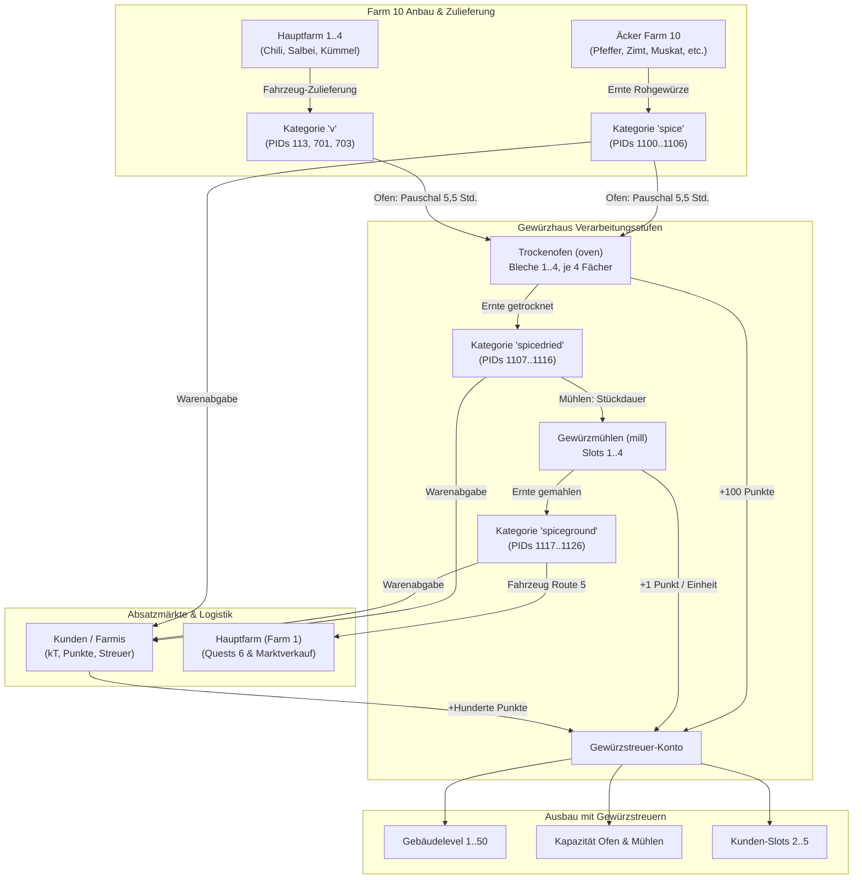

# Gewürzhaus-Modul (Farm 10, Position 2)

Das **Gewürzhaus** ist das zentrale Verarbeitungs- und Veredelungsgebäude auf **Farm 10 (Kräuter- und Gewürzfarm)**. Es wird ab Level 52 über die **Hauptquestreihe 6 (Gourmetküche-Quests)** freigeschaltet.

Es vereint eine **zweistufige Produktionskette** (Trocknen im Ofen + kontinuierliches Mahlen in Mühlen) mit einem **Kunden-System** (Farmis) und einer gebäudeeigenen Währung (**Gewürzstreuer / Gewürzhaus-Punkte**).

---

## 1. Übersicht & Architektur

---

## 2. Die Produktkette: Roh, Getrocknet, Gemahlen

Im Spiel sind Gewürze in drei disjunkte Kategorien unterteilt:

| Pflanze / Gewürz | 1. Roh (`spice`) | 2. Getrocknet (`spicedried`) | 3. Gemahlen (`spiceground`) | Mahldauer (Sek./Stück) |
| :--- | :--- | :--- | :--- | :--- |
| **Pfeffer** | PID 1100 | PID 1110 | PID 1120 | 120 s (2:00 min) |
| **Zimt** | PID 1101 | PID 1111 | PID 1121 | 240 s (4:00 min) |
| **Muskat** | PID 1102 | PID 1112 | PID 1122 | 300 s (5:00 min) |
| **Kardamom** | PID 1103 | PID 1113 | PID 1123 | 360 s (6:00 min) |
| **Nelke** | PID 1104 | PID 1114 | PID 1124 | 420 s (7:00 min) |
| **Piment** | PID 1105 | PID 1115 | PID 1125 | 600 s (10:00 min) |
| **Sternanis** | PID 1106 | PID 1116 | PID 1126 | 600 s (10:00 min) |
| **Chili** *(Hauptfarm)* | PID 113 | PID 1107 | PID 1117 | 600 s (10:00 min) |
| **Salbei** *(Hauptfarm)* | PID 701 (114) | PID 1108 | PID 1118 | 720 s (12:00 min) |
| **Kümmel** *(Hauptfarm)* | PID 703 (116) | PID 1109 | PID 1119 | 720 s (12:00 min) |

---

## 3. Die Produktionsanlagen

### 3.1 Der Trockenofen (`oven`)
* **Aufgabe:** Verarbeitet Rohgewürze (`spice`) zu getrockneten Gewürzen (`spicedried`).
* **Bleche (`lines`):**
  * **Blech 1:** Von Beginn an verfügbar.
  * **Blech 2:** Freischaltbar ab Gewürzhaus-Level 4.
  * **Blech 3:** Freischaltbar ab Gewürzhaus-Level 9.
  * **Blech 4:** Miet-Blech (kostet 5 Coins für 48 Stunden Laufzeit).
* **Fächer:** Jedes Blech verfügt über 4 Fächer/Slots. Pro Fach kann ein anderes Gewürz gewählt werden, solange die Gesamtstückzahl des Blechs die Kapazität nicht übersteigt.
* **Kapazitäts-Upgrades:** Stufen 1–20 (Kapazitäten von 10, 20, 30 ... bis 1.000 Einheiten) gegen kT, Gewürzstreuer oder Coins.
* **Trocknungszeit:** Pauschal **5,5 Stunden (19.800 Sekunden)** für alle eingelegten Bleche.
* **Ertrag & Belohnung:** Alle fertigen Trockengewürze wandern ins Farm-10-Lager; zusätzlich werden **100 Gewürzstreuer-Punkte** gutgeschrieben.

### 3.2 Die Gewürzmühlen (`mill`)
* **Aufgabe:** Mahlt getrocknete Gewürze (`spicedried`) zu feinem Pulver (`spiceground`).
* **Mühlen-Slots:**
  * **Mühle 1:** Von Beginn an verfügbar.
  * **Mühle 2:** Freischaltbar ab Gewürzhaus-Level 5.
  * **Mühle 3:** Freischaltbar ab Gewürzhaus-Level 11.
  * **Mühle 4:** Miet-Mühle (kostet 5 Coins für 48 Stunden Laufzeit).
* **Kontinuierlicher Durchlauf:** Die Mühlen stoppen nicht pauschal nach einer Blockzeit, sondern mahlen Stück für Stück gemäß der produktspezifischen Mahldauer (120 s bis 720 s je Einheit).
* **Teilentnahme:** Fertige Einheiten können jederzeit abgeholt werden (`spicehouse_harvest_mill`), während die restliche Menge weitergemahlen wird.
* **Belohnung:** Pro fertig gemahlener Einheit wird **1 Gewürzstreuer-Punkt** gutgeschrieben.
* **Upstream-Berechnung & Idle-Erkennung:**
  * Das Upstream-Game liefert in `spicehouse_init` kein direktes `output`-Feld, sondern den `start`-Timestamp und `amount`/`amount_original`.
  * Der Fortschritt wird berechnet als `finished_units = min(amount, (now - start) // unit_duration)` mit `output = max(raw_output, finished_units)`.
  * Bei der Ernte (`spicehouse_harvest_mill`) liefert `datablock` ein Dict (`{ '<pid>': amount, 'spicehouse_points': points }`).
  * Nach der Ernte behält der Spielserver die alte `pid` bei und setzt `amount = 0`. Ein Slot gilt daher als leer/belegbar (`is_idle`), wenn `amount == 0 and output == 0`. Leere Slots werden im selben Zyklus direkt neu bestückt (`spicehouse_set_millslot`).

---

## 4. Kunden-System (Gewürz-Farmis)

* **Kunden-Slots:**
  * Slot 1: Kostenlos von Beginn an aktiv.
  * Slot 2: 1.200.000 kT (ab Level 3).
  * Slot 3: 5.000.000 kT (ab Level 7).
  * Slot 4: 10.000 Gewürzstreuer-Punkte (ab Level 10).
  * Slot 5: 50 Coins (ab Level 2).
* **Warenanforderungen:** Kunden verlangen bis zu 3 verschiedene Gewürzarten in unterschiedlichen Veredelungsstufen (z. B. 80x rohe Nelken + 79x gemahlener Muskat).
* **Vergütung:**
  * **kT:** Orientiert sich am Warenwert.
  * **Erfahrungspunkte:** Wertvolle Level-Punkte.
  * **Gewürzstreuer:** Primäre Einkommensquelle für Gewürzstreuer (typisch 500 bis 2.500 Punkte pro Kunde).
* **Ablehnen:** Unrentable Kunden können mit `spicehouse_deny_customer` weggeschickt werden. Nach einer Cooldown-Zeit rückt ein neuer Kunde nach.

---

## 5. Währung & Ausbau (Gewürzstreuer)

* **Gebäude-Level 1 bis 50:** Der Levelaufstieg erfordert steigende Mengen an Gewürzstreuer-Punkten (z. B. Level 20 erfordert 475.000 Punkte).
* **Ausbau-Effekte:** Schaltet höhere Ofen- und Mühlen-Kapazitäten, neue Kunden-Slots und Errungenschaften frei.

---

## 6. Upstream-API Schnittstelle (`farm.php`)

Das Gewürzhaus kommuniziert ausschließlich über `farm.php` mit dem Spielserver:

| Aktion / `mode` | Parameter | Beschreibung |
| :--- | :--- | :--- |
| `spicehouse_init` | Keine | Lädt Gesamtzustand (Level, Ofen, Mühlen, Kunden, Konfiguration, Lager). |
| `spicehouse_open_oven` | Keine | Leert den fertigen Trockenofen und bucht getrocknete Produkte + 100 Punkte ein. |
| `spicehouse_start_oven` | `setup: json` | Startet den Ofen mit der Belegung der Bleche. |
| `spicehouse_set_millslot` | `slot: int, pid: int, amount: int` | Befüllt eine Mühle mit getrockneten Gewürzen. |
| `spicehouse_harvest_mill` | `slot: int` | Holt fertig gemahlene Einheiten aus einer Mühle ab. |
| `spicehouse_clear_mill` | `slot: int` | Bricht Mahlvorgang ab und erstattet Restware. |
| `spicehouse_accept_customer`| `slot: int` | Bedient einen Kunden (zieht Waren ab, bucht kT, Punkte und Streuer ein). |
| `spicehouse_deny_customer` | `slot: int` | Schickt einen unrentablen Kunden weg. |
| `spicehouse_add_level` | Keine | Führt Levelaufstieg des Gewürzhauses durch (verbraucht Streuer). |
| `spicehouse_upgrade_ovenline`| `line: int` | Verbessert die Kapazität eines Ofenblechs. |
| `spicehouse_upgrade_millslot`| `slot: int` | Verbessert die Kapazität einer Gewürzmühle. |
| `spicehouse_buy_customerslot`| `slot: int` | Schaltet zusätzlichen Kundenplatz frei. |
| *(Gesperrt)* `spicehouse_speedup_oven` | Keine | **Strikt verboten:** Verkürzt Ofenzeit gegen reale Coins. |
| *(Gesperrt)* `spicehouse_speedup_customer` | `slot: int` | **Strikt verboten:** Beschleunigt Kundenankunft gegen Coins. |
| *(Gesperrt)* `spicehouse_rent_ovenline` | `line: 4` | Mietet Blech 4 gegen 5 Coins für 48h. |
| *(Gesperrt)* `spicehouse_rent_mill` | `slot: 4` | Mietet Mühle 4 gegen 5 Coins für 48h. |

---

## 7. Logistische Regeln (Farm 10)

1. **Kein Rücktransport von Rohgewürzen:** Rohgewürze (`spice`) werden auf Farm 10 angebaut und verbleiben dort als Vorrat für den Trockenofen. Sie dürfen nicht als Ernteüberschuss an die Hauptfarm gesendet werden.
2. **Transport von gemahlenen Gewürzen:** Gemahlene Gewürze (`spiceground`) sind die transportfähigen Endprodukte für Hauptquests (Reihe 6) und Marktverkäufe. Der Fahrzeugtransporter (Route 5) transportiert gemahlene Produkte nach Farm 1.
3. **Zulieferung von Grundgewürzen:** Chili (113), Salbei (701) und Kümmel (703) müssen bei Bedarf von Farm 1 nach Farm 10 transportiert werden.
