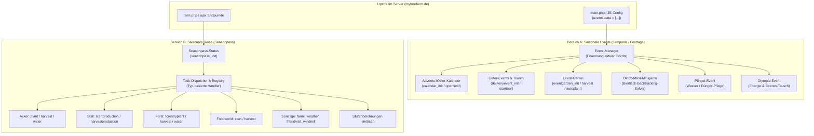
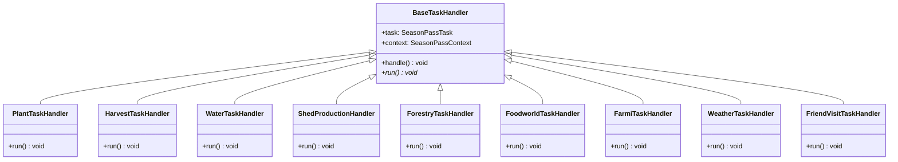

# Saisonevents & Saisonale Reise (Seasonpass)

Dieses Dokument beschreibt die Mechaniken, Upstream-API-Schnittstellen, Datenstrukturen und Algorithmen für alle zeitlich befristeten **Saisonevents** sowie das System der **Saisonalen Reise (Seasonpass)** in MyFreeFarm. Es dient als verbindliche Spezifikationsgrundlage für die anschließende Python-Implementierung.

---

## 1. Systemübersicht & Zweiteilung

Das Event-Ökosystem von MyFreeFarm teilt sich in zwei Hauptbereiche:



---

## 2. Bereich A: Saisonale Events (Temporäre Aktionen)

### 2.1 Event-Erkennung & Lifecycle

Aktive Events werden vom Spielserver in der JavaScript-Konfiguration der Hauptseite (`main.php`) hinterlegt. 

- **Erkennungsmuster (Regex):**
  ```regex
  events\.data\s*=\s*\[(.*?)\];
  ```
  Innerhalb des Arrays repräsentiert jedes Objekt ein aktives Event mit der Eigenschaft `"name": "<event_name>"`.
- **Typische Event-Namen:** `calendar`, `deliveryevent`, `eventgarden`, `oktoberfest`, `pentecostevent`, `olympia`.
- **Lifecycle:**
  Der Bot prüft in jedem Durchlauf die Liste der aktiven Events und leitet die Ausführung an den jeweiligen Event-Service weiter. Ist ein Event nicht mehr in `events.data` gelistet, pausiert der entsprechende Service automatisch.

---

### 2.2 Advents- & Event-Kalender (`calendar`)

Verwendet zu Weihnachten (Adventskalender) sowie gelegentlich zu Ostern oder Frühlingsfesten.

- **Aufgabe:** Tägliches Öffnen des aktuellen Kalendertürchens und Abholen der Gratis-Belohnung (kT, Punkte, Power-Ups).
- **API-Endpunkte:**
  1. **Status abrufen:**
     - `GET/POST /ajax/farm.php?mode=calendar_init`
     - Antwort (`datablock`):
       - `day`: Aktueller Tag des Monats / Events (z. B. `1` bis `24`).
       - `config.fields`: Wörterbuch aller verfügbaren Kalendertüren (`{"1": {...}, "2": {...}}`).
       - `data.days`: Wörterbuch oder Liste bereits geöffneter Tage.
  2. **Türchen öffnen:**
     - `GET/POST /ajax/farm.php?mode=calendar_openfield&field={day}&day=1`
- **Algorithmus:**
  1. Rufe `calendar_init` auf.
  2. Prüfe: Ist der aktuelle Tag `str(day)` in `config.fields` vorhanden und **noch nicht** in `data.days` enthalten?
  3. Falls ja: Sende `calendar_openfield` mit `field=day` und `day=1`.

---

### 2.3 Liefer-Events & Liefertouren (`deliveryevent`)

Wiederkehrendes Großevent (z. B. Erntedank, Ostern, Halloween, Sommerfest).

- **Aufgabe:** Automatische Abfertigung von Liefertouren zur Maximierung der Event-Punkte bei minimaler Dauer.
- **API-Endpunkte:**
  1. **Status abrufen:**
     - `GET/POST /ajax/farm.php?mode=deliveryevent_init`
     - Antwort (`datablock`):
       - `data.points`: Aktueller Stand der gesammelten Event-Währung/Punkte.
       - `data.tour`: Aktuell laufende Tour (falls vorhanden). Enthält `remain` (Restdauer in Sekunden) und `spot` (Zielort).
       - `config.spots`: Wörterbuch aller verfügbaren Zielorte.
         - Pro Spot: `points` (benötigte Event-Punkte zur Aktivierung), `duration` (Reisedauer in Sekunden), `name`.
  2. **Liefertour starten:**
     - `GET/POST /ajax/farm.php?mode=deliveryevent_starttour&spot={spot_id}`
- **Optimierungs-Algorithmus (Effizienz-Quotient):**
  1. Prüfe `data.tour`: Läuft aktuell eine Tour (`remain > 0`), wird der Zyklus beendet.
  2. Berechne für jeden verfügbaren Spot in `config.spots` den Effizienz-Quotienten:
     $$\text{outcome} = \frac{\text{spot.points}}{\text{spot.duration}}$$
  3. Sortiere alle Spots absteigend nach `outcome` (höchster Punktedurchsatz pro Zeiteinheit).
  4. Wähle unter den besten Kandidaten denjenigen Spot aus, dessen Punktebedarf durch den aktuellen Vorrat gedeckt ist (`spot.points <= actual_points`).
  5. Starte die Tour via `deliveryevent_starttour`.

---

### 2.4 Event-Garten (`eventgarden`)

Ein temporärer, separater Schrebergarten mit eigenen Beeten und speziellem Event-Saatgut.

- **Aufgabe:** Vollautomatisiertes Ernten und Wiederbepflanzen der Event-Beete.
- **API-Endpunkte:**
  1. **Gartenstatus abrufen:**
     - `GET/POST /ajax/farm.php?mode=eventgarden_init`
     - Antwort (`datablock`):
       - `data.tiles`: Wörterbuch aller Gartenbeete (mit `remain`, `status`, `plant`).
       - `data.stock`: Spezial-Lagerbestand an Event-Pflanzen (`{pid: amount}`).
       - `config.products`: Definitionen der Event-Pflanzen.
  2. **Alles abernten:**
     - `GET/POST /ajax/farm.php?mode=eventgarden_harvest_all`
  3. **Vollflächig anpflanzen:**
     - `GET/POST /ajax/farm.php?mode=eventgarden_autoplant&plant={pid}`
- **Algorithmus:**
  1. Wenn Beete vorhanden sind und alle reif sind (`len(tiles[remain > 0]) == 0`):
     - Führe `eventgarden_harvest_all` aus.
  2. Wenn die Beete leer sind:
     - Ermittle aus `data.stock` die Event-Pflanze mit dem **größten verfügbaren Saatgutbestand** (`amount > 0`).
     - Bepflanze den gesamten Eventgarten über `eventgarden_autoplant`.

---

### 2.5 Oktoberfest-Event & Biertisch-Minigame (`oktoberfest`)

Ein logisches Puzzle-Minispiel, bei dem Schafe an einem Biertisch so platziert werden müssen, dass Nachbarn und Gegenübersitzende gemeinsame Interessen teilen.

- **Aufgabe:** Automatisches Lösen der Sitzordnung per Backtracking-Algorithmus.
- **API-Endpunkte:**
  1. **Status abrufen:**
     - `GET/POST /ajax/farm.php?mode=oktoberfest_init`
     - Antwort (`datablock`):
       - `data.cooldown_remain`: Wartezeit bis zur nächsten Spielrunde (wenn `> 0`, abbrechen).
       - `data.sheeps`: Wörterbuch der wartenden Schafe. Jedes Schaf besitzt eine Liste von Interessen: `{"1": {"interests": ["pretzel", "beer", "music"]}, ...}`.
  2. **Schaf platzieren:**
     - `GET/POST /ajax/farm.php?mode=oktoberfest_set_sheep&slot={seat}&sheep={sheep_id}`
  3. **Runde abschließen & Belohnung kassieren:**
     - `GET/POST /ajax/farm.php?mode=oktoberfest_finish`

#### Der Backtracking-Solver
Die Plätze am Tisch sind durchnummeriert von $0$ bis $N-1$ (mit $N = \text{Anzahl Schafe}$, typischerweise gerade Anzahl, geteilt in zwei gegenüberliegende Bankreihen mit $\text{half} = N // 2$).

**Gültigkeitsregeln (`is_valid`):**
1. **Nachbar auf derselben Bank ($index > 0$ und nicht Beginn der 2. Reihe):**
   $$\text{interests}(seating[index - 1]) \cap \text{interests}(person) \neq \emptyset$$
2. **Gegenübersitzende Person ($index \ge half$):**
   $$\text{interests}(seating[index - half]) \cap \text{interests}(person) \neq \emptyset$$

**Ablauf:**
1. Backtracking durchläuft rekursiv Plätze $0 \dots N-1$.
2. Sobald eine vollständige, konsistente Zuweisung gefunden wurde, werden die Schafe per API auf ihre Sitze platziert (`oktoberfest_set_sheep`).
3. Anschließend wird `oktoberfest_finish` ausgelöst.

---

### 2.6 Pfingst-Event (`pentecostevent`)

- **Aufgabe:** Regelmäßige Pflege (Gießen und Düngen) der Event-Pflanze.
- **API-Endpunkte:**
  1. `GET/POST /ajax/farm.php?mode=pentecostevent_init`
  2. `GET/POST /ajax/farm.php?mode=pentecostevent_care&type=water`
  3. `GET/POST /ajax/farm.php?mode=pentecostevent_care&type=fertilizer`
- **Bedingungen:**
  - Gießen: Wenn `water_remain <= 0` und `available_water >= required_water`.
  - Düngen: Wenn `fertilizer_remain <= 0` und `available_fertilizer >= required_fertilizer`.

---

### 2.7 Olympia-Event (`olympia`)

- **Aufgabe:** Teilnahme an Wettkämpfen durch Umtausch von Event-Beeren in Energie.
- **API-Endpunkte:**
  1. `GET/POST /ajax/main.php?action=olympia_init`
  2. `GET/POST /ajax/main.php?action=olympia_entry&amount=10`
- **Bedingung:**
  - Wenn `energy < 100` und ausreichende Beeren im Vorrat vorhanden sind, wird der Antritt eingereicht.

---

## 3. Bereich B: Saisonale Reise (Seasonpass)

### 3.1 Das Seasonpass-System

Die Saisonale Reise ist eine ca. 30- bis 60-tägige Kampagne (z. B. `season7`), bei der Spieler durch das Lösen täglich wechselnder Aufgaben Saisonpunkte sammeln. Mit steigender Punktzahl werden Belohnungsstufen freigeschaltet.

- **API-Initialisierung:**
  - `GET/POST /ajax/farm.php?mode=seasonpass_init`
- **Datenstruktur (`datablock.data`):**
  - `name`: Name der aktuellen Saison (z. B. `"season7"`).
  - `points`: Aktuelle Gesamtpunktzahl.
  - `remain`: Verbleibende Sekunden der Gesamtsaison.
  - `tasks`: Liste der aktuell offenen, aktiven Aufgaben.
  - `tasksDone`: Liste der in der aktuellen Periode bereits erledigten Aufgaben.
  - `rewards`: Status der Belohnungsstufen (`{"1": {"free": {"time": 1770...}}}`).

---

### 3.2 Datenmodell der Aufgaben (`SeasonPassTask`)

Jede Aufgabe in `tasks` besitzt folgende Struktur:

```json
{
  "id": "460860",
  "unr": "17626250",
  "name": "season7",
  "type": "startproduction",
  "data": {
    "building": 4,
    "pid": 11,
    "count": 1,
    "points": 100,
    "done": 0
  },
  "createdate": "1771369205",
  "finishdate": "0",
  "remain": 150828
}
```

- `id`: Eindeutige ID der Aufgaben-Instanz.
- `type`: Typenkennung für den Handler-Dispatcher.
- `data.count`: Geforderte Anzahl an Aktionen.
- `data.done`: Bereits erbrachter Fortschritt.
- `data.points`: Belohnungspunkte bei Abschluss.
- `data.pid`: Spezifische Produkt-ID (oder `0`, falls jedes Produkt der Kategorie zählt).
- `data.building`: Zielgebäude (z. B. `1` = Acker, `4` = Tierstall).

---

### 3.3 Modulare Handler-Architektur (Task-Dispatcher)

Die Abarbeitung erfolgt entkoppelt über eine **Task-Registry**, die Aufgaben anhand ihres `type` an spezialisierte Handler delegiert.



---

### 3.4 Katalog der Seasonpass-Aufgabentypen

| Aufgabentyp (`type`) | Beschreibung | Benötigte Aktionen / API-Aufrufe |
| :--- | :--- | :--- |
| **`plant`** | Pflanzen anbauen | Auf einem konfigurierten Ackerfeld (`Field`) ernten, Pflanze mit PID `payload.pid` anbauen und gießen. |
| **`harvest`** | Pflanzen ernten | Reife Ackerpflanzen abernten (`gardenharvest`). |
| **`water`** | Felder gießen | Ackerflächen mit Wasser versorgen (`gardenwater`). |
| **`startproduction`** | Tierstall starten | Tierstall mit Gebäude-ID `payload.building` füttern und Produktion starten (`inner_feed`). |
| **`harvestproduction`** | Stallprodukte ernten | Tierställe leeren (`inner_harvest`). |
| **`forestryplant`** | Baum pflanzen | Im Forstbereich Baumplatz roden (`forestry?action=cancelcrop`), Setzling mit PID `payload.pid` pflanzen (`action=plant`) und gießen (`action=water`). |
| **`forestryharvest`** | Baum fällen | Ausgewachsenen Baum im Forst fällen (`action=harvest`). |
| **`forestrywater`** | Bäume gießen | Alle Forstelemente bewässern (`action=water`). |
| **`foodworldstartproduction`** | Picknick-Gericht starten | In der Foodworld-Küche die Produktion für Gericht `payload.pid` anstoßen. |
| **`foodworldharvestproduction`**| Picknick-Gericht ernten | Fertige Gerichte in Foodworld abholen. |
| **`farmi`** | Hof-Kunden bedienen | Farmis am Farmrand prüfen und den erstbesten erfüllbaren Auftrag bedienen (`farmisell`). |
| **`weather`** | Wetterbericht abrufen | Einmalig das Wetterzentrum aufrufen: `mode: "weather_init", farm: 2, position: 0`. |
| **`friendvisit`** | Schaugarten besuchen | Schaugarten eines Mitspielers öffnen: `mode: "visitor_init", unr: friend_id` gefolgt von `mode: "friends_init"`. |
| **`startwindmillproduction`** | Windmühle starten | In Klein-Muhstein die Mühle mit einem Rezept bestücken (`windmillstartproduction`). |

---

### 3.5 Belohnungsstufen abholen

Erreicht das Punktekonto die Schwelle einer Stufe (`rewards`), kann die Stufe kostenlos eingelöst werden. Der Status wird im Zyklus geprüft und unbeanspruchte Gratis-Belohnungen werden automatisch aktiviert.

---

## 4. Python-Zielarchitektur (`myfreefarm_python`)

Für das anstehende Python-Redesign wird folgende saubere Modulstruktur implementiert:

```
myfreefarm_python/app/modules/
├── events/
│   ├── __init__.py
│   ├── manager.py               # Erkennt aktive Events via events.data Regex
│   ├── calendar.py              # CalendarEventService (Türchen öffnen)
│   ├── delivery.py              # DeliveryEventService (Optimierte Liefertouren)
│   ├── eventgarden.py           # EventGardenService (Ernten & Autoplant)
│   ├── oktoberfest.py           # OktoberfestService (Backtracking Biertisch-Solver)
│   └── pentecost.py             # PentecostService (Gießen / Düngen)
└── seasonpass/
    ├── __init__.py
    ├── models.py                # Pydantic v2: SeasonPassTask, SeasonPassSnapshot
    ├── service.py               # SeasonPassService (Orchestrierung & Snapshot)
    ├── task_registry.py         # Dekorator-basierte Registry (@register("type"))
    └── handlers/
        ├── __init__.py
        ├── base.py              # BaseTaskHandler mit Dependency-Injektion
        ├── plant.py             # Acker-Pflanz- und Erntehandler
        ├── sheds.py             # Tierstall-Handler
        ├── forestry.py          # Baumerei-Handler
        ├── foodworld.py         # Foodworld-Handler
        ├── farmi.py             # Farmi-Handler
        ├── misc.py              # Weather, FriendVisit, Windmill
        └── defaults.py          # NoOp-Logging-Fallback für unbekannte Tasks
```

### Integration in den Worker-Scheduler (`WorkerScheduler`):
Die Event-Services und der Seasonpass werden im 10-Minuten-Zyklus nach der Versorgung der Kernbetriebe (Äcker, Ställe, Fabriken) ausgeführt:
```python
# Ausführung im Scheduler-Zyklus:
if settings.events.enabled:
    await event_manager.serve()

if settings.seasonpass.enabled:
    await seasonpass_service.serve(stock_service=stock_service)
```
