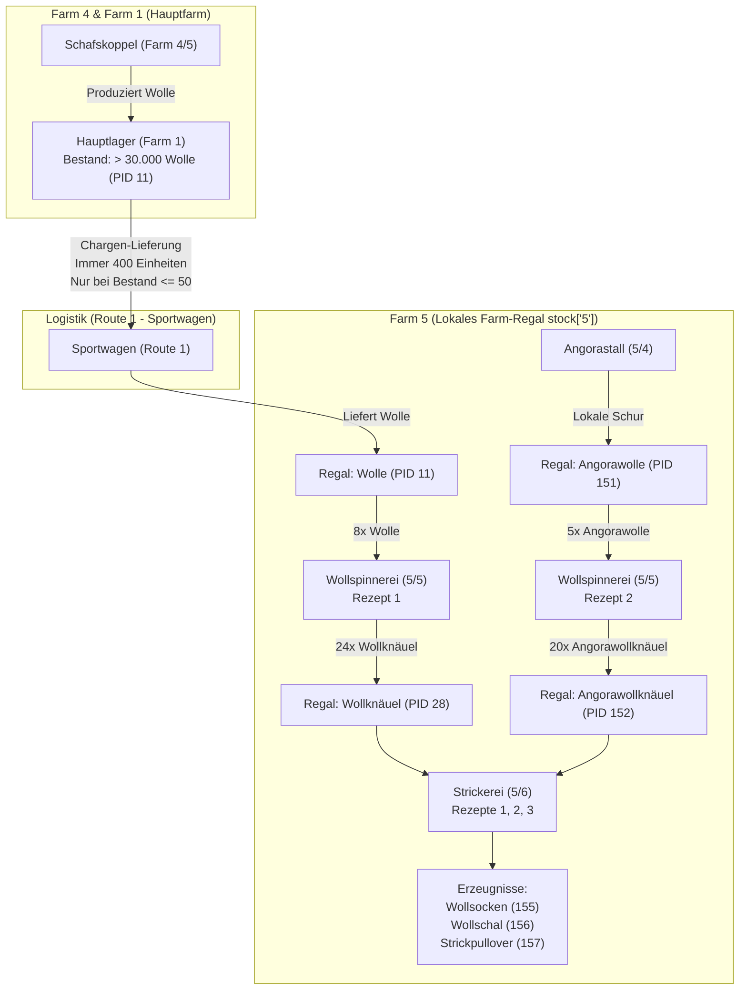

# Spezialfarm 5 (Exotenfarm & Textile Veredelungskette)

Farm 5 ist eine der komplexesten Außenfarmen in MyFreeFarm. Sie vereint exotischen Ackerbau, Tierhaltung und eine zweistufige industrielle Veredelungskette mit geschlossenen Materialkreisläufen.

---

## 1. Gebäude-Übersicht auf Farm 5

| Position | Gebäude-ID | Name | Funktion | Lokale Eingangs-Rohstoffe | Erzeugnisse / Ausgänge |
| :--- | :--- | :--- | :--- | :--- | :--- |
| **Pos 1–3** | `1` | **Äcker (Exoten)** | Exotischer Ackerbau (Kategorie `ex`) | Lokales Saatgut aus Regal `stock['5']` | Ananas (351), Limette (352), Papaya (354), Banane (356), Mango (359) |
| **Pos 4** | `14` | **Angorastall** | Angorakaninchen-Zucht | Karotten / Futter (Farm 1) | **Angorawolle (PID 151)** direkt ins Farm-5-Regal |
| **Pos 5** | `9` | **Wollspinnerei (Stufe 4)** | Garn- und Wollknäuel-Herstellung | Schafwolle (PID 11) & Angorawolle (PID 151) | **Wollknäuel (PID 28)** & **Angorawollknäuel (PID 152)** |
| **Pos 6** | `16` | **Strickerei (Stufe 1)** | Textilverarbeitung | Wollknäuel (PID 28) & Angorawollknäuel (PID 152) | **Wollsocken (PID 155)**, **Wollschal (PID 156)**, **Strickpullover (PID 157)** |

---

## 2. Die textile Kreislaufwirtschaft



---

## 3. Logistik & Spritschonender Batch-Modus (Route 1)

Um Treibstoff zu sparen und den Laderaum für Erntegüter nicht durch Kleinstlieferungen zu blockieren, nutzt Route 1 einen intelligenten Meldebestand-Modus:

### Konfiguration (`data/user_config.json`):
```json
"5": {
  "farm_id": 5,
  "route": 1,
  "vehicle": 4,
  "auto_fastest": true,
  "transport": true,
  "required_products": ["Kohlrabi", "Wolle"],
  "supply_threshold": 400,
  "reorder_threshold": 50,
  "required_product_targets": {
    "Wolle": 400,
    "Kohlrabi": 400
  },
  "required_reorder_thresholds": {
    "Wolle": 50,
    "Kohlrabi": 50
  }
}
```

### Funktionsweise:
1. **Feste Transportmenge:** Wann immer Wolle transportiert wird, belädt das Fahrzeug **exakt eine volle Charge von 400 Einheiten**.
2. **Meldebestand (`reorder_threshold: 50`):**
   - Solange auf Farm 5 noch mehr als 50 Einheiten Wolle liegen (z. B. 392, 200 oder 100), fährt das Fahrzeug **ohne Wolle** nach Farm 5.
   - Der Laderaum steht zu 100 % für Exotenernten (Ananas, Limetten) und Strickwaren auf dem Rückweg nach Farm 1 zur Verfügung.
3. **Automatische Nachbestellung:** Erst wenn der Vorrat durch den Betrieb der Wollspinnerei auf $\le 50$ sinkt, wird bei der nächsten Tour die nächste 400er-Charge nachgeliefert.

---

## 4. Automatischer Bestands-Ausgleich in der Wollspinnerei (Pos 5)

Die Wollspinnerei stellt sicher, dass **sowohl Wollknäuel als auch Angorawollknäuel** in ausreichender Menge vorhanden sind:

### Rezepte:
- **Rezept 1:** 8x Wolle (PID 11) $\to$ **24x Wollknäuel (PID 28)** (Faktor 3!).
- **Rezept 2:** 5x Angorawolle (PID 151) $\to$ **20x Angorawollknäuel (PID 152)** (Faktor 4!).

### Entscheidungs-Algorithmus (`Factory.select_recipe()`):
1. **Priorität 1 (Quests):** Fordert eine aktive Quest eine der Knäuelarten, wird diese sofort produziert.
2. **Priorität 2 (Min-Bestand auf Farm 5):**  
   Der Bot vergleicht die Bestände im Farm-5-Regal:
   $$\text{Zielrezept} = \arg\min (\text{Bestand Wollknäuel}, \text{Bestand Angorawollknäuel})$$
   - Verbraucht die Strickerei viele Angorawollknäuel, sinkt deren Bestand und die Spinnerei schaltet automatisch auf Rezept 2 um.
   - Sinken die normalen Wollknäuel ab, schaltet die Spinnerei auf Rezept 1 um.
   - Beide Wollarten bleiben dauerhaft im dynamischen Gleichgewicht.

---

## 5. Exoten-Ackerbau (Pos 1–3)

- **Kategorie:** Strikte Beschränkung auf Exoten (`category = "ex"`).
- **Saatgut-Schutz:** Auf jedem Acker wird eine Sicherheitsreserve von $120 / (\text{size\_x} \times \text{size\_y})$ Samen im lokalen Regal geschützt.
- **Lokale Saatgut-Prüfung:** Der `PlantStrategySolver` prüft vor der Aussaat, ob Saatgut im Farm-5-Regal vorrätig ist (`stock_service.get_farm_amount(5, pid) > 0`). Ist ein Quest-Saatgut leer, greift die dynamische Fallback-Kette (`failed_pids`), damit kein Acker brach liegt.
